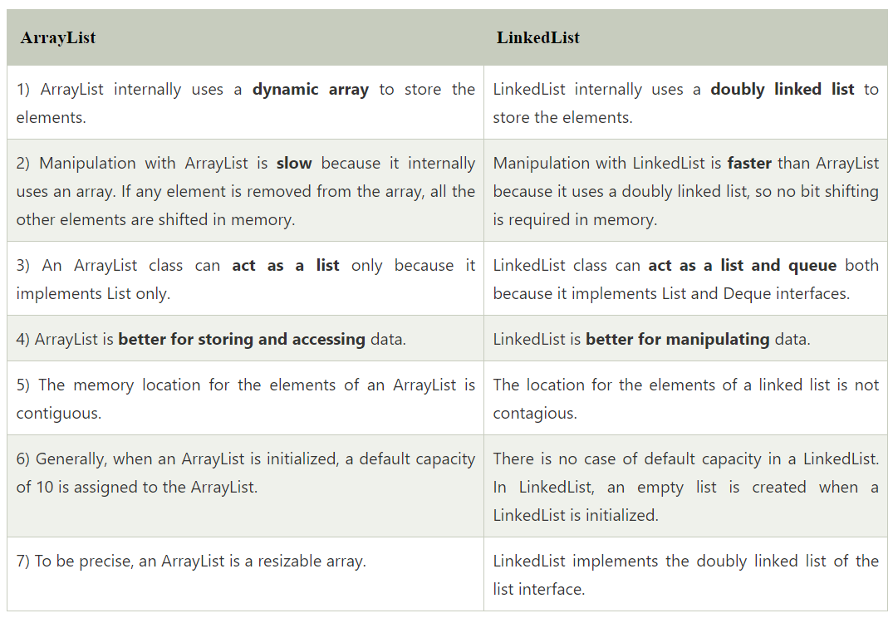
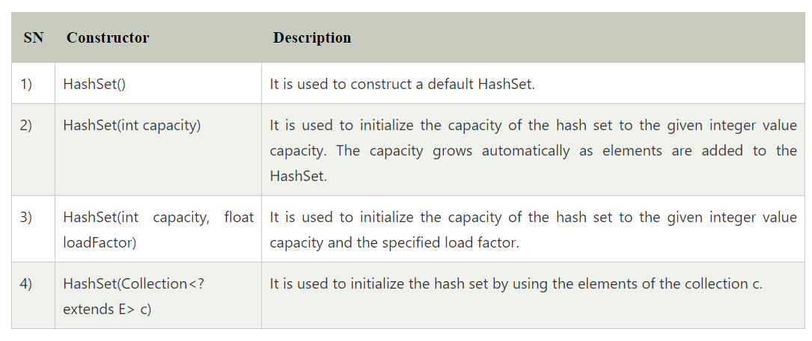
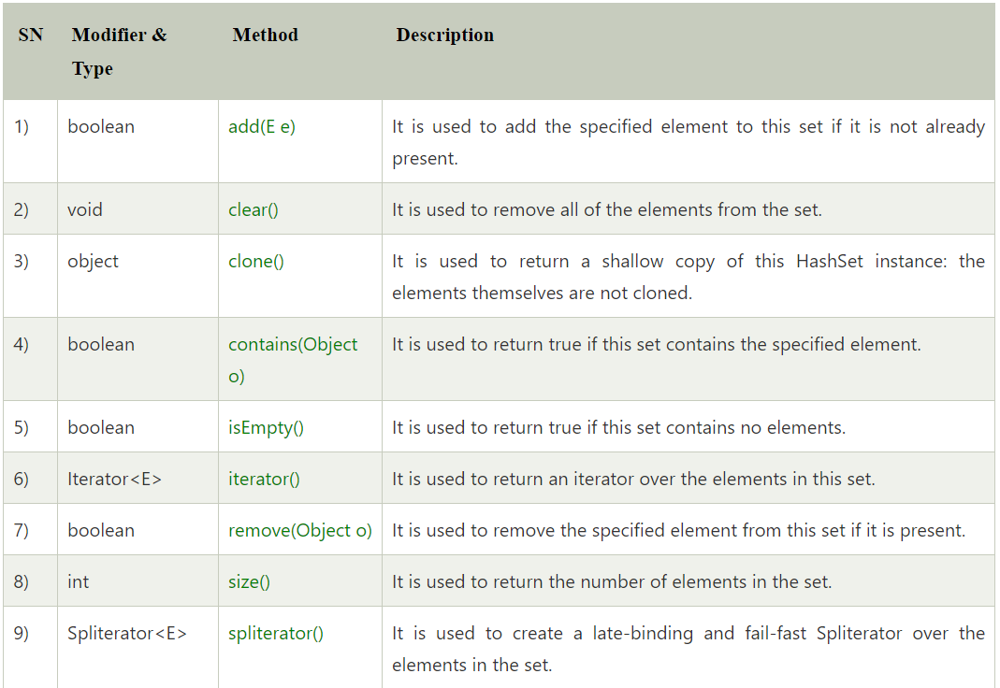
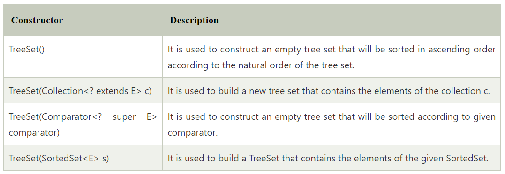
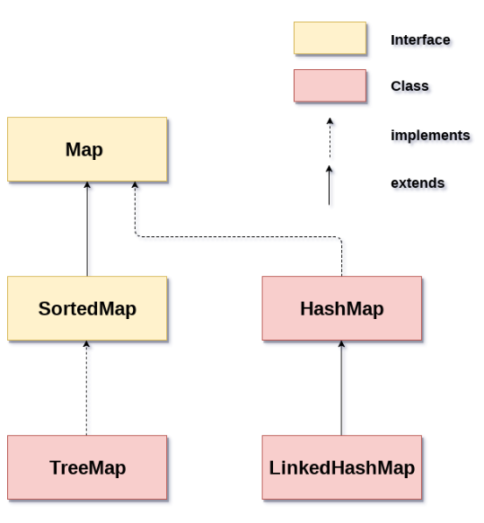
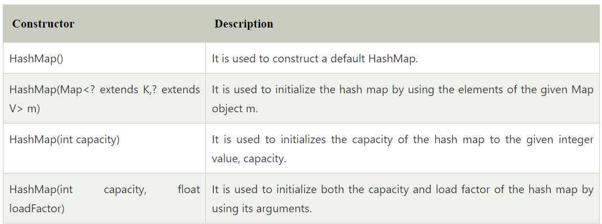
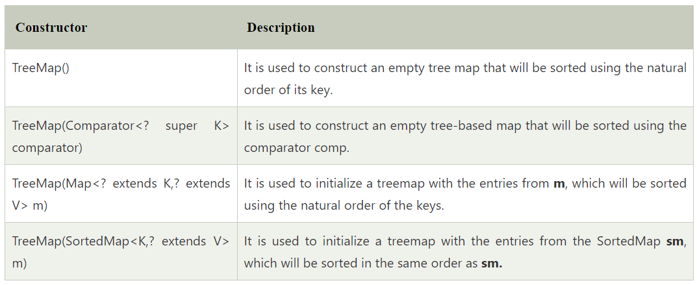
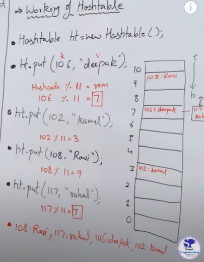

## Data Structure.

- It is the way by which we can store the data in a efficient way.

- It is mainly used to reduce the space and time complexity of the task.

### Types of Data Structure.


**Primitive data structure**

- Primitive data structure is a fundamental type of data structure that stores the data of only one type 

- For smaller application we can use primitive data structure. For example - Calculation or snake game.

**Non-primitive data structure** 

- Non-primitive data structure is a type of data structure which is a user-defined that stores the data of different types in a single entity.

- For large application we need to use non-primitive data structure as we need lots of data in a single object and for faster retrieval and deletion of data we also need algorithm in this type of application. For example ecommerce website.


## Difference between Arrays and Collections.

### Arrays
- Arrays can store both primitive and non-primitive data.

```java
int[] a = {1,2,3,4}//Primitive data type
class Test{

}
Test [] t = {obj1, obj2, obj3, obj4}//Non-primitive data type
```
- Arrays can store only homogeneous type of data.

- Arrays size is fixed we cannot increase or decrease the size of an array at runtime.

- Arrays are inbuilt features of java and thus we need to develop algorithm for insertion and deletion.


### Collection Framework

- Collection framework can store only non-primitive type of data.

```java
ArrayList al = new ArrayList();
al.add(obj1);//Non primitive data 
al.add(10);//Non primitive data as it will store this value as object.
```
- Collection can store only heterogeneous type of data.

- Collection size is not fixed we can increase or decrease the size of the collections at runtime.

- Collection framework is an API which provides pre defined classes interfaces and methods.

## Collection Framework.

- It is the set of predefined classes and interface which is used to store multiple data.

- It contains 2 main parts.

  - java.util.Collection

  - 

  - java.util.Map

  - 

**What is Collection Framework, Collection and Collections?**

**Collection Framework(API)** - It is an API which contain predefined classes and interfaces.

**Collection(Interface)** - It is the root interface(present in java.util.package) of all the collection objects

**Collections(Utility Class)**. - It is the utility class which contain only static method. 


### Collection framework hierarchy


## Collection Interface.

- Collection is an interface which is present in java.util.package

- Syntax ```public interface Collection <E> extends Interable<E>```

- Hierarchy of Collection


- Methods of Collection

  - ```public boolean add(Object obj)```
  ```java
  ArrayList al = new ArrayList();
  al.add(10);//adding object in collection 
  al.add(20);
  System.out.println(al.add(30))//It will return boolean value which is true that means the value is added in the collection.
  ```

  - ```public boolean addAll(Collection c)```

  ```java
  ArrayList ak = new ArrayList();
  ak.add(al)//Adding collection in other collection
  ```

  -```public boolean remove(Object obj)```

  ```java
  ArrayList al = new ArrayList();
  al.add(10);//adding object in collection 
  al.add(20);
  ak.remove(0)//We have to provide the index value in the remove method the value 10 will get deleted 
  ```

  -```public boolean removeAll(Collection c)```

  ```java
   ArrayList al = new ArrayList();
  al.add(10);
  al.add(20);
  al.add(34);
  al.add(44);
  ArrayList ak = new ArrayList();
  ak.add('a');
  ak.add('b');
  ak.add('c');
  al.addAll(ak);
  System.out.println(al);
  al.removeAll(ak);
  System.out.println(al);

  ```

  -```void clear()```

  ```java
  ArrayList al = new ArrayList();
  al.add(10);
  al.add(20);
  al.add(34);
  al.add(44);
  al.clear();
  System.out.println(al);
  ```

  -```boolean contains(Object obj)```

  ```java
  ArrayList al = new ArrayList();
  al.add(10);//adding object in collection 
  al.add(20);
  System.out.println(al.contains(10))//It will print true
  ```

  -```boolean containsAll(Collection c)```

  ```java
   ArrayList al = new ArrayList();
  al.add(10);
  al.add(20);
  al.add(34);
  al.add(44);
  ArrayList ak = new ArrayList();
  ak.add('a');
  ak.add('b');
  ak.add('c');
  al.addAll(ak);
  System.out.println(al.containsAll(ak));
  ```

  -```boolean isEmpty()```

  ```java
  ArrayList al = new ArrayList();
  System.out.println(al.isEmpty());//It will return false as there is no object in al collection
  ```

  -```int size()```

  ```java
  ArrayList al = new ArrayList();
  al.add(1);
  al.add(2);
  al.add(3);
  System.out.println(al.size());//It will return 3 
  ```

  -```Iterator iterator()```


## Difference between set and list.

### list

- List in an indexed based data structure.

- List can store duplicate element.

- List can store any number of null values.

- List follows the insertion order.

- We can iterate the list element by Iterator and ListIterator.


```java
import java.util.ArrayList;
import java.util.Iterator;
import java.util.List;
public class ListDemo{
    public static void main(String args[]){
        List l = new ArrayList();
        l.add(10);//It is a indexed based data structure value is store in a sequence wise
        l.add(20);
        l.add(20);//We can add duplicate value in list
        l.add(null);
        l.add(null);//We can add multiple null value
        Iterator itr = l.iterator();//Here we can use ListIterator interface also to iterate through the collection
        while(itr.hasNext()){
            System.out.println(itr.next());
        }
    }
}
```

### set

- Set is not an indexed based data structure. It stores the data according to the hashcode values.

- Set does not allow to store duplicate element.

- Set can store only one null value.

- We can iterate the set element by Iterator only.

- Set does not follow the insertion order.

```java
import java.util.HashSet;
import java.util.Set;
public class SetDemo{
    public static void main(String args[]){
       Set s = new HashSet();
       s.add(3);
       s.add(4);//It is not an indexed based data structure that means value is not stored in a sequence wise.
       s.add(4);//We cannot add duplicate value in set
       s.add(null);
       s.add(null);//We cannot store null values as it dont allow duplicacy
        Iterator itr = s.iterator();//Here there is no ListIterator only Iterator
        while(itr.hasNext()){
            System.out.println(itr.next());
        }
    }
}

```

## Iterator and ListIterator

### Iterator

- We can get Iterator cursor by iterator() method.

  - Iterator itr = l.iterator();

- Iterator can be used with any collection object.

- Iterator methods are : 

  - hasNext() , next() , remove()

- By using the Iterator cursor we can retrieve the element only in forward direction.

- By using the Iterator cursor we can read and remove the elements.

```java

import java.util.ArrayList;
import java.util.Iterator;
import java.util.List;
public class ListDemo{
    public static void main(String args[]){
        List l = new ArrayList();
        l.add(10);
        l.add("Ashish");
        l.add("Yadav");
        Iterator itr = l.iterator();//It will create object name itr with all the elements copied from the l collection
        while(itr.hasNext()){//It will check whether any next element is present or not it will return boolean value.
            System.out.println(itr.next());//It will print the next value 
        }
    }
}

```

### ListIterator

- We can get ListIterator cursor by ListIterator() method.

  - ListIterator li = l.listIterator();

- ListIterator cursor can be used only with List implemented classses i.e, ArrayList, LinkedList, Vector, Stack.

- ListIterator methods are : 

  - hasNext() , next() , hasPrevious() , previous() , remove() , set().

- By using ListIterator cursor we can retrieve the elements in both forward and backward direction.

- By using ListIterator cursor we can read, remove, replace and add the element.

```java

import java.util.ArrayList;
import java.util.ListIterator;
import java.util.List;
public class ListDemo{
    public static void main(String args[]){
        List l = new ArrayList();
        l.add(10);
        l.add("Ashish");
        l.add("Yadav");
        ListIterator itr = l.listIterator();//It will create object name itr with all the elements copied from the l collection
        while(itr.hasNext()){//It will check whether any next element is present or not it will return boolean value.
            System.out.println(itr.next());//It will print the next value 
        }
        while(itr.hasPrevious()){//This code will get execute only by moving the cursor forward then only we can move the cursor backward to print the element
            System.out.println(itr.previous());
        }
    }
}

```

## Enumeration

- Enumeration is the cursor which is used to retrieve collection object one oby one.

- Enumeration was introduced in JDK 1.0 version.

- Enumeration cursor can be used only with legacy classes i.e, Vector and Stack.

- Enumeration cursor can be get by elements() method.

  - ```Enumeration e = v.elements();```

- Methods of enumeration cursor are 

  - ```hasMoreElement()```
  - ```nextElement()```

- Enumeration cursor can be used to retrive the element only in the forward direction.

- Enumeration cursor can be used only for read operation.

```java
import java.util.Vector;
import java.util.Enumeration;

class Test{
    public static void main(String args[]){
        Vector v = new Vector();
        v.add(5);
        v.add("Ashish");
        v.add(10.5);

        //System.out.println(v);

        Enumeration e = v.elements();//It works only for the legacy class like vector and stack.
        while(e.hasMoreElements()){
            System.out.println(e.nextElement())
        }
    }
}
```

## ArrayList

- ArrayList is an implemented class of List Interface which is present in java.util package

- **Syntax**

  ```java package java.util;
  class ArrayList implements List{
    //constructor
    //method
  }

  ```
- Array list is created on the basis of growable or resizable array.

### Properties of ArrayList

- ArrayList are indexed based data structure.

- ArrayList can store differenct types of data type.

- ArrayList can store duplicate values.

- ArrayList can store any number of null values.

- ArrayList follows the insertion order i.e the elements are stored and retrieved in a sequential manner.

- ArrayList does not follow the sorting order.

- ArrayList are non-synchronized.


## ArrayList Constructors and Methods.

```java
class Test{
    public static void main(String args[]){
        //Constructors
        ArrayList all = new ArrayList();//default constructor with capacity of 10 i.e this arraylist can store 10 element.
        all.add(4);
        all.add(5);
        all.add(6);
        ArrayList all2 = new ArrayList(6);//Initial capacity constructor - It means this capacity can store 6 element.
        ArrayList all3 = new ArrayList(all);//It will add all the value of collection object all to all3.

    }
}
```


## Linked list

- Linked List is an implemented class of List interface which is present in java.util package.

- **Syntax**

  ```java
  class LinkedList implements List,Deque{
    //constructor
    //method
  }

- The underlying data structure of Linked List is "doubly linked list" or "circular linked list".

   

### Advantage.

- Insertion and deletion operation are fast.

- We can traverse the list in forward and backward direction both.

### Disadvantage.

- It occupies extra space for previous node address.

- In case of insertion or deletion of element in between we have to manage the previous and next node of that element.

### Properties

- Linked list are indexed based data structure.

- Linked List can store different data types.

- Linked List can allow duplicate element.

- Linked List can add duplicate values.

- Linked List follows the insertion order but linked list does not follow the sorting order.

- Linked List are non synchronized collection so it is not thread safe and it runs very fastly.

## Linked List methods and constructors.

```java
interface Collection{
  boolean add(Object obj);
  boolean addAll(Collection c);

  boolean remove(Object obj);
  boolean removeAll(Collection c);

  void clear();

  boolean contains(Object obj);
  boolean containsAll(Collection c);

  boolean isEmpty();

  int size();

  Iterator iterator();

  ---etc
}

interface List extends Collection {
  //contains collection interface method
  
  void add(int index, Object ob);
  void addAll(int index, Collection c);

  Object get(int index);

  Object remove(int index);

  Object set(int index, Object newObj);

  int indexOf(Object obj);
  int lastIndexOf(Object obj);

  ---etc
}

class LinkedList implements List, Deque{
  //contains Collection, List and Deque method.

  void addFirst(Object obj);
  void addLast(Object obj);

  Object getFirst();
  Object getLast();

  Object removeFirst();
  Object removeLast();


}

```
### Linked List constructor.

1. LinkedList(): This constructor is used to create an empty linked list. If we wish to create an empty LinkedList with the name ll, then, it can be created as: 

   ```LinkedList ll = new LinkedList();  ```

2. LinkedList(Collection C): This constructor is used to create an ordered list that contains all the elements of a specified collection, as returned by the collection’s iterator. If we wish to create a LinkedList with the name ll, then, it can be created as: 

   ```LinkedList ll = new LinkedList(C);```


## Difference between ArrayList and Linked List.



## Legacy classes 

**Some classes i.e Vector, Stack Hashtable etc was introduced in JDK 1.0 version but when collection framework was introduced in JDK 1.2 version there classes were modified or say re-engineered so that they can be adjusted in new collection hierarchy, so these older classes are known as legacy classes**

### Vector

- Vector is a legacy class which was introduced in JDK 1.0 version.

- Vector is an implemented class of list interface which is present in java.util package.

   **Syntax**

   ```java
   class Vector implements List{
    //constructors
    //methods
   }
   ```

- The underlying data structure of vector is ""growable or resizable arrray".

#### Properties

- Vector is an indexed based data structure.

- Vector can store different data types.

- We can store duplicate elements and multiple null values.

- Vector follows the insertion order and not sorting order.

- Vector are synchronized collection.(Note - All legacy classes are synchronized).

#### Methods of vector class.

- It contains list and collection interface methods.

   ```addElement(Object obj)```

   ```firstElement()```

   ```lastElement()```

   ```removeElement(Object obj)```

   ```removeElementAt(int index)```

   ```removeAllElement()```

   ```capacity()```

```java

import java.util.Vector;

class Test{
  public static void main(String args[]){

    //constructor
    Vector v = new Vector();//construct an empty vector so that its internal data array has size 10
    Vector v1 = new Vector(6);//empty vector with size 6
    Vector v2 = new Vector(Collection c)//Collection c will get added in Vector v2
    Vector v4 = new Vector(int initialCapacity, int capacityIncrement)//Capacity of the vector will increase with this constructor.

    v.add("Ashish");
    v.add("yadav");
    v.add(7);
    System.out.println(v);

  }
}

```

## ArrayList vs Vector

### ArrayList

- ArrayList is not a legacy class. It is introduced in JDK 1.2.

- ArrayList is not synchronized.

- ArrayList increments 50% ((oldcapacity*3/2)+1) of current array size if the number of elements exceeds from its capacity.

- ArrayList is fast because it is non-synchronized.

- ArrayList uses the Iterator interface to traverse the elements.

- It does not provide data consistency.

### Vector

- Vector is a legacy class. It is introduced in JDK 1.0

- Vector is synchronized.

- Vector increments 100% means doubles the array size if the total number of elements exceeds than its capacity. (oldcapacity*2)

- Vector is slow because it is synchronized, i.e., in a multithreading environment, it holds the other threads in runnable or non-runnable state until current thread releases the lock of the object.

- A Vector can use the Iterator interface or Enumeration interface to traverse the elements.

- It provides data consistency.


## Stack

- Stack is the legacy which was introduced in JDK 1.0 version.

- Stack is the child class of Vector class which is present in java.util package.

**Syntax**

   ```java

   class Stack extends Vector{

    //constructors
    //methods

   }

   ```

### Properties of stack.

- Stack class was designed on the basis of LIFO(Last In First Out).

- Stack can be implemented on the basis of arrays, ArrayList, Linked list and Vector.

- Stack is an indexed based data structure.

### Constructor

```Stack()```

### Method

```push()``` - The method pushes (insert) an element onto the top of the stack.

```pop()``` - The method removes an element from the top of the stack and returns the same element as the value of that function.

```peek()``` - The method looks at the top element of the stack without removing it.

```search(Object o)``` - The method searches the specified object and returns the position of the object.

```empty()``` - The method checks the stack is empty or not.

```java
import java.util.Stack;
class Test{
  public static void main(String args[]){
    Stack s = new Stack();
    s.push(5);
    s.push(6);
    s.push(7);
    System.out.println(s.pop());
    System.out.println(s.peek());
    System.out.println(s.empty());
    System.out.println(s.search(5));
  }
}
```

## HashSet

- It is an implemented class of Set interface which is present in java.util package.

- **Syntax**

  ```java
  class HashSet implements Set{
    //connstructors
    //methods
  }
  ```

- HashSet underlying data structure is "Hash Table".

- HashSet is backed up by **Map**

- HashSet was introduced in JDK 1.2 version.

### Properties of HashSet

- HashSet are not indexed based data structure. They store the elements according to their hashcode value.

- HashSet does not store duplicate elements, as the elemets are stored internally in map as a key and key does not allow duplicate element.

- HashSet cannot store multiple null values.

- HashSet can store different data types i.e heterogeneous element.

- HashSet does not follow insertion order.

- HashSet does not follow the sorting order.

- HashSet are non synchronized data structure so multiple threads can execute parallelly.


## Methods and Constructor of HashSet

```java
import java.util.HashSet;
public class Test{
  public static void main(String args[]){
    HashSet hs = new HashSet();
    hs.add(4);
    hs.add("Ashish");
    hs.add(49);
    hs.add("Ashish");//Duplicate value will not get added
    System.out.println(hs);//does not follow the insertion order and sorting order
    Iterator itr = hs.iterator();
    while(itr.hasNext()){//display the elements one by one
      System.out.println(itr.next());
    }
  }
}

```
### Constructors



### Methods



## TreeSet

- TreeSet directly implements class of navigable set but indirectly implements SortedSet and Set Interface which is present in java.util package.

- **Syntax**

   ```java

   class TreeSet implements NavigableSet{
    //constructors
    //methods
   }

- It was introduced in JDK 1.2 version

- TreeSet underlying data structure in balanced tree.

### Properties of TreeSet

- It is not an indexed based data structure.

- It does not follow the insertion order.

- It follows the sorting order

**Internal Working**

TreeSet is being implemented using a binary search tree, which is self-balancing just like a Red-Black Tree. Therefore, operations such as a search, remove, and add consume O(log(N)) time. It uses compareTo(Object obj) method. It is a Comparable Interface method which is used to compare the current object with the specified object. It returns as follows : 

  - +ve integer : If the current object is greater than the specified object.
  - -ve integer : If the current object is less than the specified object.
  - 0 : If the current object is equal to the specified object.

- It stores the homogeneous element i.e same data type.

- It cannot stores the duplicate elements.

- It is a non synchronized data structure. Multiple thread can execute simultaneously.

- It cannot store the null values. It was possible to add in the first node before JDK 1.6 version.

## TreeSet methods and constructors.

```java
import java.util.TreeSet;
public class Test{
  public static void main(String args[]){
    TreeSet ts = new TreeSet();
    ts.add(3);
    ts.add(40);
    ts.add(20);
    ts.add("Ashish");//We cant add element with different data type
    ts.add(null);//We cant add null values
    System.out.println(ts);//It prints the element in sorted order
  }
}
```

### Constructors



### Methods

https://www.javatpoint.com/java-treeset


## Map

- Map is an interface which is present in java.util package.

- **Syntax**

   ```java
   public interface Map{
    //methods
   }
   ```

- Map was introduced in JDK 1.2 version

- Hierarchy of Map interface

  


### Properties of Map

- Map stores the data in key value pair

- In Map key should be unique but value can be duplicate.

- In Map we can store maximum one null value in key but can store multiple null values in value

- Map does not follow the sorting and insertion order.

### Methods of Map

```java
import java.util.HashMap;
import java.util.Map;
public class Test{
  public static void main(String args[]){
    Map map = new HashMap();
    map.put(101, "Ashish");
    map.put(102, "Yadav");
    map.put(103, "Ravi");
    System.out.println(map.containsKey(101));//It check whether the key is present or not
    System.out.println(map.containsValue("Ashish"));//It checks whether the value is present or not
    System.out.println(map.get(101));//It prints the value of that key
    System.out.println(map.remove(103));//It removes the entry
    map.replace(102,"Deepak");//It replace the value
    System.out.println(map.size());//It gives size of the map
    System.out.println(map);
    map.clear();
    System.out.println(map);

  }
}

```

## HashMap

- HashMap is an implemented class of Map interface which is present in java.util package.

- **Syntax**

  ```java
  class HashMap implements Map{
    //constructor
    //method
  }

- HashMap was introduced in JDK 1.2 version.

- HashMap underlying data structure is Hash table.

### Properties of HashMap

- HashMap stores the value in key value pair.

- **Each Key value pair is known as entry**

- In HashMap key should always be unique but value can be duplicate.

- HashMap contains maximum one null value in key but it can store multiple null values in value.

- HashMap can store different data type i.e heterogeneous element.

- HashMap does not follow the sorting or insetion order.

- HashMap is non synchronized data structure. Multiple threads can run parralely.

## HashMap methods.

```java

import java.util.HashMap;
import java.util.Set;
import java.util.Iterator;
import java.util.Map;
class Test{
  public static void main(String args[]){
    HashMap <Integer, String> hm = new HashMap();
    hm.put(101, "Ashish");
    hm.put(102, "Rahul");
    hm.put(103, "Mohit");
    hm.put(104, "Deepak");
    System.out.println(hm);
    System.out.println(hm.containsKey(103));
    System.out.println(hm.get(103));
    
    for(Map.Entry me: hm.entrySet()){
        System.out.println(me.getKey() + "----->" + me.getValue());
    }
    hm.remove(104);
    System.out.println(hm);
    
    
    // Set set = hm.entrySet();
    // // System.out.println(set);
    // Iterator itr = set.iterator();
    // while(itr.hasNext()){
    //     // System.out.println(itr.next());/
    //     Map.Entry entry = (Map.Entry) itr.next();
    //     System.out.println(entry.getKey() + "--->" + entry.getValue());
        
    // }
  }
}
```

### Constructors.



### Methods

https://www.javatpoint.com/java-hashmap

## TreeMap

- It is implemented class of NavigableMap but it also inherits the properties of SortedMap and Map interface.

- **Syntax**

  ```java
  class TreeMap implements NavigableMap{
    //constructor
    //method
  }

- It was introduced in JDK 1.2 version.

- TreeMap underlying data structure is "Red-Black" tree.

**Properties of Red black tree.**

  - Every node is either red or black colour.
  - The root node is always black.
  - Every leaf node(NULL node) is black.
  - If a node is red, then both its children is black.
  - For each node, all paths from the node to its descendant leaf nodes contains the same number of black nodes.

### Properties of TreeMap.

- We store the data in key value pair in which keys should be should unique but value can be duplicate.

- TreeMap does not follows the insertion order but follows the sorting order with respect to keys.

- It can store both homogeneous(default sorting nature) and heterogeneous elements(if using comparator).

- TreeMap cannot store null values.

- TreeMap is non synchronized Data structure. Multiple thread can execute parallely.

## TreeMap methods.

```java
import java.util.TreeMap;
class Test{
  public static void main(String args[]){
    TreeMap map = new TreeMap();
    map.put(107, "Ashish");
    map.put(105, "Rahul");
    map.put(104, "Manish");
    map.put(112, "Mohit");
    System.out.println(map);//follows the sorting order wrt keys.
    System.out.println(map.ceilingEntry(106));//It will return 112 key value as there is no 106 key.
    System.out.println(map.ceilingKey(106));//It will only return ceiling key.
    System.out.println(map.containsKey(106));//It will return false as there is no 106 key.
    System.out.println(map.firstEntry());//It will return first entry of the treemap.
    System.out.println(map.firstKey());//It will return the key of the first entry.
    System.out.println(map.floorEntry(106));//opposite of ceiling Entry.
    System.out.println(map.get(105));//It will print "Rahul".
    System.out.println(map.headMap(106));//It returns the key-value pairs whose keys are strictly less than toKey.
    System.out.println(map.higherEntry(106));//It returns the least key strictly greater than the given key, or null if there is no such key.
    System.out.println(map.keySet(106));//It returns the collection of keys exist in the map.
    System.out.println(map.pollFirstEntry(106));//It removes and returns a key-value mapping associated with the least key in this map, or null if the map is empty.
    System.out.println(map.size());//It return the size of teh treemap.
    map.replace(104, "jj");
    map.clear();//It will delete all the values inside map.
  }
}
```

### Constructor.



### Methods.

https://www.javatpoint.com/java-treemap

## HashTable

- HashTable is the direct implemented class of Map interface. It is present in java.util package.

- **Syntax**

   ```java
   class Hashtable implements Map{
    //constructor
    //method
   }

- It is a legacy class and was introduced in JDK 1.0 version.

- HashTable underlying data structure is HashTable.

### Properties of HashTable.

- Hastable contains the data in key value pair and each key value pair is know as entry.

- In HashTable key should always be unique but value can be duplicate.

- HashTable can store hetrogeneous elements or different types of elements at key position.

- We cannot store null value in HashTable.

- HashTable does not follow insertion order or sorting order.

- HashTable are synchronized data structure.

### Working of HashTable

We can consider a Hashtable as an array of buckets, where each bucket contains a list of entries. An entry consists of both keys and values. We specify a key and the value thatcan be linked to that key. The key is then hashed to generate a hash code that is furtherused as the index at which the value is stored within the table. The function that helps in getting the location of values from hashcode is called as hash function. It always returns a positive integer value known as hashcode. 

**Formula to allocate index**

```indexNumber = hashNumber % totalBuckets```

**Collision in Hashtable**

As discussed earlier, multiple objects might get same hashcode which leads to a situation called collision. It occurs when two or more keys have the same hash value and are mapped to the same bucket resulting in slow performance.



