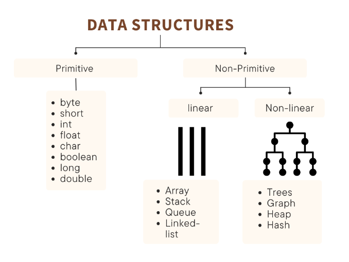
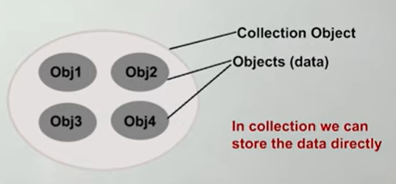
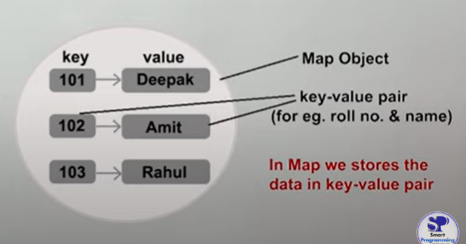
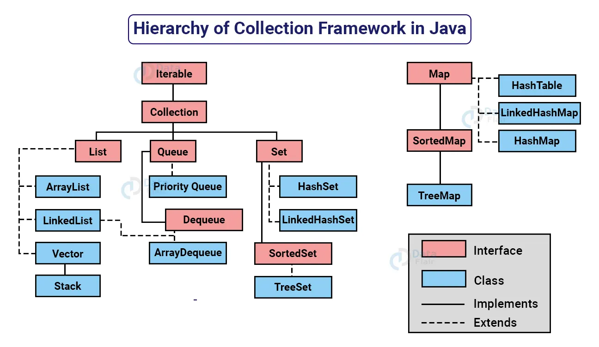
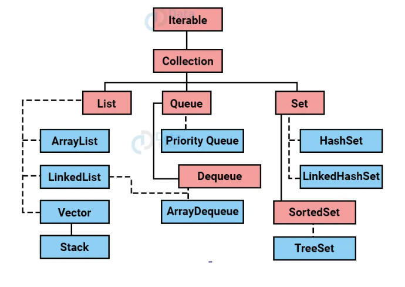
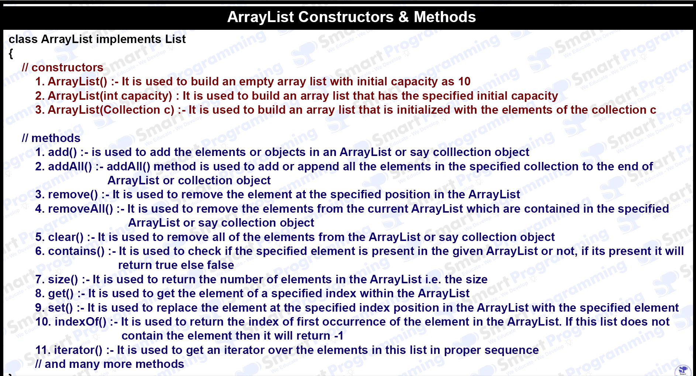
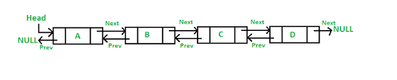

## Data Structure.

- It is the way by which we can store the data in a efficient way.

- It is mainly used to reduce the space and time complexity of the task.

### Types of Data Structure.



**Primitive data structure**

- Primitive data structure is a fundamental type of data structure that stores the data of only one type 

- For smaller application we can use primitive data structure. For example - Calculation or snake game.

**Non-primitive data structure** 

- Non-primitive data structure is a type of data structure which is a user-defined that stores the data of different types in a single entity.

- For large application we need to use non-primitive data structure as we need lots of data in a single object and for faster retrieval and deletion of data we also need algorithm in this type of application. For example ecommerce website.


## Difference between Arrays and Collections.

### Arrays
- Arrays can store both primitive and non-primitive data.

```java
int[] a = {1,2,3,4}//Primitive data type
class Test{

}
Test [] t = {obj1, obj2, obj3, obj4}//Non-primitive data type
```
- Arrays can store only homogeneous type of data.

- Arrays size is fixed we cannot increase or decrease the size of an array at runtime.

- Arrays are inbuilt features of java and thus we need to develop algorithm for insertion and deletion.


### Collection Framework

- Collection framework can store only non-primitive type of data.

```java
ArrayList al = new ArrayList();
al.add(obj1);//Non primitive data 
al.add(10);//Non primitive data as it will store this value as object.
```
- Collection can store only heterogeneous type of data.

- Collection size is not fixed we can increase or decrease the size of the collections at runtime.

- Collection framework is an API which provides pre defined classes interfaces and methods.

## Collection Framework.

- It is the set of predefined classes and interface which is used to store multiple data.

- It contains 2 main parts.

  - java.util.Collection

  - 

  - java.util.Map

  - 

**What is Collection Framework, Collection and Collections?**

**Collection Framework(API)** - It is an API which contain predefined classes and interfaces.

**Collection(Interface)** - It is the root interface(present in java.util.package) of all the collection objects

**Collections(Utility Class)**. - It is the utility class which contain only static method. 


### Collection framework hierarchy



## Collection Interface.

- Collection is an interface which is present in java.util.package

- Syntax ```public interface Collection <E> extends Interable<E>```

- Hierarchy of Collection



- Methods of Collection

  - ```public boolean add(Object obj)```
  ```java
  ArrayList al = new ArrayList();
  al.add(10);//adding object in collection 
  al.add(20);
  System.out.println(al.add(30))//It will return boolean value which is true that means the value is added in the collection.
  ```

  - ```public boolean addAll(Collection c)```

  ```java
  ArrayList ak = new ArrayList();
  ak.add(al)//Adding collection in other collection
  ```

  -```public boolean remove(Object obj)```

  ```java
  ArrayList al = new ArrayList();
  al.add(10);//adding object in collection 
  al.add(20);
  ak.remove(0)//We have to provide the index value in the remove method the value 10 will get deleted 
  ```

  -```public boolean removeAll(Collection c)```

  ```java
   ArrayList al = new ArrayList();
  al.add(10);
  al.add(20);
  al.add(34);
  al.add(44);
  ArrayList ak = new ArrayList();
  ak.add('a');
  ak.add('b');
  ak.add('c');
  al.addAll(ak);
  System.out.println(al);
  al.removeAll(ak);
  System.out.println(al);

  ```

  -```void clear()```

  ```java
  ArrayList al = new ArrayList();
  al.add(10);
  al.add(20);
  al.add(34);
  al.add(44);
  al.clear();
  System.out.println(al);
  ```

  -```boolean contains(Object obj)```

  ```java
  ArrayList al = new ArrayList();
  al.add(10);//adding object in collection 
  al.add(20);
  System.out.println(al.contains(10))//It will print true
  ```

  -```boolean containsAll(Collection c)```

  ```java
   ArrayList al = new ArrayList();
  al.add(10);
  al.add(20);
  al.add(34);
  al.add(44);
  ArrayList ak = new ArrayList();
  ak.add('a');
  ak.add('b');
  ak.add('c');
  al.addAll(ak);
  System.out.println(al.containsAll(ak));
  ```

  -```boolean isEmpty()```

  ```java
  ArrayList al = new ArrayList();
  System.out.println(al.isEmpty());//It will return false as there is no object in al collection
  ```

  -```int size()```

  ```java
  ArrayList al = new ArrayList();
  al.add(1);
  al.add(2);
  al.add(3);
  System.out.println(al.size());//It will return 3 
  ```

  -```Iterator iterator()```


## Difference between set and list.

### list

- List in an indexed based data structure.

- List can store duplicate element.

- List can store any number of null values.

- List follows the insertion order.

- We can iterate the list element by Iterator and ListIterator.


```java
import java.util.ArrayList;
import java.util.Iterator;
import java.util.List;
public class ListDemo{
    public static void main(String args[]){
        List l = new ArrayList();
        l.add(10);//It is a indexed based data structure value is store in a sequence wise
        l.add(20);
        l.add(20);//We can add duplicate value in list
        l.add(null);
        l.add(null);//We can add multiple null value
        Iterator itr = l.iterator();//Here we can use ListIterator interface also to iterate through the collection
        while(itr.hasNext()){
            System.out.println(itr.next());
        }
    }
}
```

### set

- Set is not an indexed based data structure. It stores the data according to the hashcode values.

- Set does not allow to store duplicate element.

- Set can store only one null value.

- We can iterate the set element by Iterator only.

- Set does not follow the insertion order.

```java
import java.util.HashSet;
import java.util.Set;
public class SetDemo{
    public static void main(String args[]){
       Set s = new HashSet();
       s.add(3);
       s.add(4);//It is not an indexed based data structure that means value is not stored in a sequence wise.
       s.add(4);//We cannot add duplicate value in set
       s.add(null);
       s.add(null);//We cannot store null values as it dont allow duplicacy
        Iterator itr = s.iterator();//Here there is no ListIterator only Iterator
        while(itr.hasNext()){
            System.out.println(itr.next());
        }
    }
}

```

## Iterator and ListIterator

### Iterator

- We can get Iterator cursor by iterator() method.

  - Iterator itr = l.iterator();

- Iterator can be used with any collection object.

- Iterator methods are : 

  - hasNext() , next() , remove()

- By using the Iterator cursor we can retrieve the element only in forward direction.

- By using the Iterator cursor we can read and remove the elements.

```java

import java.util.ArrayList;
import java.util.Iterator;
import java.util.List;
public class ListDemo{
    public static void main(String args[]){
        List l = new ArrayList();
        l.add(10);
        l.add("Ashish");
        l.add("Yadav");
        Iterator itr = l.iterator();//It will create object name itr with all the elements copied from the l collection
        while(itr.hasNext()){//It will check whether any next element is present or not it will return boolean value.
            System.out.println(itr.next());//It will print the next value 
        }
    }
}

```

### ListIterator

- We can get ListIterator cursor by ListIterator() method.

  - ListIterator li = l.listIterator();

- ListIterator cursor can be used only with List implemented classses i.e, ArrayList, LinkedList, Vector, Stack.

- ListIterator methods are : 

  - hasNext() , next() , hasPrevious() , previous() , remove() , set().

- By using ListIterator cursor we can retrieve the elements in both forward and backward direction.

- By using ListIterator cursor we can read, remove, replace and add the element.

```java

import java.util.ArrayList;
import java.util.ListIterator;
import java.util.List;
public class ListDemo{
    public static void main(String args[]){
        List l = new ArrayList();
        l.add(10);
        l.add("Ashish");
        l.add("Yadav");
        ListIterator itr = l.listIterator();//It will create object name itr with all the elements copied from the l collection
        while(itr.hasNext()){//It will check whether any next element is present or not it will return boolean value.
            System.out.println(itr.next());//It will print the next value 
        }
        while(itr.hasPrevious()){//This code will get execute only by moving the cursor forward then only we can move the cursor backward to print the element
            System.out.println(itr.previous());
        }
    }
}

```

## Enumeration

- Enumeration is the cursor which is used to retrieve collection object one oby one.

- Enumeration was introduced in JDK 1.0 version.

- Enumeration cursor can be used only with legacy classes i.e, Vector and Stack.

- Enumeration cursor can be get by elements() method.

  - ```Enumeration e = v.elements();```

- Methods of enumeration cursor are 

  - ```hasMoreElement()```
  - ```nextElement()```

- Enumeration cursor can be used to retrive the element only in the forward direction.

- Enumeration cursor can be used only for read operation.

```java
import java.util.Vector;
import java.util.Enumeration;

class Test{
    public static void main(String args[]){
        Vector v = new Vector();
        v.add(5);
        v.add("Ashish");
        v.add(10.5);

        //System.out.println(v);

        Enumeration e = v.elements();//It works only for the legacy class like vector and stack.
        while(e.hasMoreElements()){
            System.out.println(e.nextElement())
        }
    }
}
```

## ArrayList

- ArrayList is an implemented class of List Interface which is present in java.util package

- **Syntax**

  ```java package java.util;
  class ArrayList implements List{
    //constructor
    //method
  }

  ```
- Array list is created on the basis of growable or resizable array.

### Properties of ArrayList

- ArrayList are indexed based data structure.

- ArrayList can store differenct types of data type.

- ArrayList can store duplicate values.

- ArrayList can store any number of null values.

- ArrayList follows the insertion order i.e the elements are stored and retrieved in a sequential manner.

- ArrayList does not follow the sorting order.

- ArrayList are non-synchronized.


## ArrayList Constructors and Methods.

```java
class Test{
    public static void main(String args[]){
        //Constructors
        ArrayList all = new ArrayList();//default constructor with capacity of 10 i.e this arraylist can store 10 element.
        all.add(4);
        all.add(5);
        all.add(6);
        ArrayList all2 = new ArrayList(6);//Initial capacity constructor - It means this capacity can store 6 element.
        ArrayList all3 = new ArrayList(all);//It will add all the value of collection object all to all3.

    }
}
```


## Linked list

- Linked List is an implemented class of List interface which is present in java.util package.

- **Syntax**

  ```java
  class LinkedList implements List,Deque{
    //constructor
    //method
  }

- The underlying data structure of Linked List is "doubly linked list" or "circular linked list".

   

### Advantage.

- Insertion and deletion operation are fast.

- We can traverse the list in forward and backward direction both.

### Disadvantage.

- It occupies extra space for previous node address.

- In case of insertion or deletion of element in between we have to manage the previous and next node of that element.

### Properties

- Linked list are indexed based data structure.

- Linked List can store different data types.

- Linked List can allow duplicate element.

- Linked List can add duplicate values.

- Linked List follows the insertion order but linked list does not follow the sorting order.

- Linked List are non synchronized collection so it is not thread safe and it runs very fastly.

