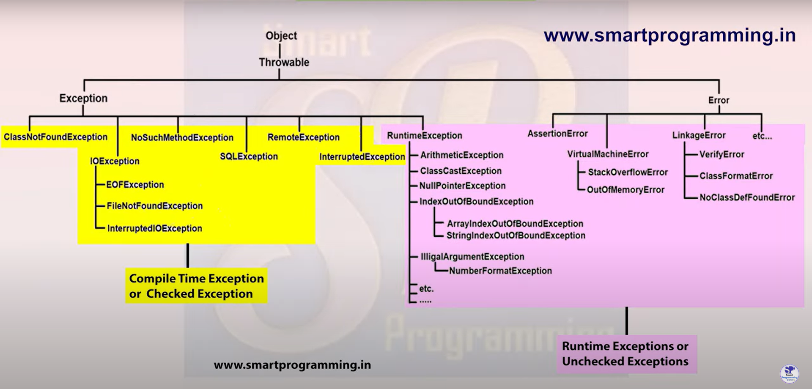
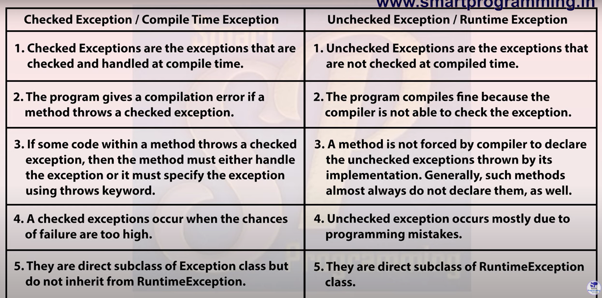

# Exception Handling

An Exception is an unwanted or unexpected event, which occurs during the execution of the program i.e at run time, that disrupts the normal flow of the program.

Exception Handling is one of the powerful mechanism to **handle** the runtime errors so that the normal flow of the application can be maintained.

```java

class Test{
    public static void main(String args[]){
        System.out.println("1");
        System.out.println("2");
        System.out.println("3");
        System.out.println("4");
        System.out.println(100/0);//Arithmetic Exception occur over here which disrupt the flow of the program the output will be 1 2 3 4 and error
        System.out.println("5");
        System.out.println("6");
        System.out.println("7");
    }
}

```

## Hierarchy of Exception class

- Object class is the parent class of all the class.
- Throwable is the parent class of the exception and the error.
- Exception can be divided into two part Compile time exception(Checked Exception) and Runtime exception(Unchecked Exception)



### Difference between exception and error


### Compile time exception.

- These exception are detected by the Java compiler before the program is executed.
- Example - ClassNotFoundException, FileNotFoundException.

```java

import java.io.FileInputStream;
class Test{
    public static void main(String args[]){
        FileInputStream fis = new FileInputStream("d:/abc.txt");//It will warn us about the exception before the program is executed during  compile time.
        //It can be fixed with try catch block
    }
}

```

### Runtime exception

- These exception are not checked by java compiler hence it will throws error only after execution.
- Example - ArithmeticException, IndexOutOfBoundException

```java
class Test {

    public static void main(String args[])
    {
        // Here we are dividing by 0
        // which will not be caught at compile time
        // as there is no mistake but caught at runtime
        // because it is mathematically incorrect
        int x = 0;
        int y = 10;
        int z = y / x;
    }
}
```



## try catch || Control flow in try catch

```java

class Test{
    public static void main(String args[]){
        int a = 100, b = 0, c;
        c = a/b;//Artithmetic Exception
        System.out.println(c);
    }
}

```

Whenever there is exception, the method in which exception occurs will create and object and that object will store three things.

- exception name
- description
- stack trace

Then this object will pass to JVM and then JVM will check if you are handling this exception or not if not then the program will abnormally terminate and the control will pass to the default exception handler which will print the details about the exception.

If we want to handle the exception manually then we can do that by using 5 keywords.

1. try
2. catch
3. finally
4. throw
5. throws

### try catch

**Syntax**

```java

try{
    //risky code
}
catch(ExceptionClassName ref.var.name){
    //handling code
}

```

```java
class Test{
    public static void main(String args[]){
        try{
            int a = 100, b = 0, c;
             c = a/b;//Artithmetic Exception
             System.out.println(c);
        }
        catch(Exeption e){// e strore the object data created by the method.
            System.out.println(e);
        }
        System.out.println("Hello");//Here as we handled the code properly using try catch block so the program will run properly and will not terminate abnormally and Hello will get printed.
    }
}

```

- e store the object data created by the method.
- If we know the name of the exception then we can pass as a argument in catch block otherwise just pass Exception class in the argument as it is the parent class of all the Exception class it will work fine.

### control flow of try catch.

```java
class Test{
    public static void main(String args[]){
        try{
            int a = 100, b = 0, c;
             c = a/b;//Artithmetic Exception
             System.out.println(c);
        }

        catch(Exeption e){// e strore the object data created by the method.
            System.out.println(e);
        }
        System.out.println("Hello");//Here as we handled the code properly using try catch block so the program will run properly and will not terminate abnormally and Hello will get printed.
    }
}

```

- If there is no exception in try block then catch block will not get executed. It will be skipped.

```java

class Test{
    public static void main(String args[]){
        System.out.println("1");
        try{
            System.out.println("2");
            int a = 100, b = 0, c;
            System.out.println("3");
             c = a/b;//Artithmetic Exception
             System.out.println("4");//This code will get skipped as there is exception before this line so the control will move directly to catch block.
             System.out.println(c);// This code also
        }
        catch(ArithmeticException e){// e strore the object data created by the method.
             System.out.println("5");
            System.out.println(e);
        }
        System.out.println("6");
    }
}

```

### Method to print exception information in java.

There are three ways by which we can print exception information in java.

1. e.printStackTrace()

   - It print Exception name, Description, Stack Trace

2. System.out.println(e) or System.out.println(e.toString())

   - It print Exception name and Description but not stack trace.

3. System.out.println(e.getMessage())

   - It will print only description but not Exception name and stack trace.

```java

class Test{
    public static void main(String args[]){
        try{
            int a = 100, b = 0, c;
            c = a/b;
            System.out.println(c);
        }
        catch(ArithmeticException e){
            e.printStackTrace(); //It prints Exception name, Description and Stack Trace.
            System.out.println(e); //It prints Exception name and Description only.
            System.out.println(e.getMessage()); //It print only description.
        }

    }

}

```

## finally block

In Java, a finally block is a piece of code that always runs, no matter what happens in a try block. Whether an exception is thrown or not, the finally block ensures certain actions are taken, like closing files or releasing resources. It's like a safety net that ensures important tasks are done, regardless of errors.

**Syntax**

```java
try{
    //risky code
    //file open
    //read write - If any exception occur while reading or writing the file then below code will not get executed so we provide closing code in finally block.
}
catch{
    //handling code
}
finally{
    //cleanup code
    //close
}

//We can also use finally without catch block

try{

}
finally{

}
```

- If exception occurs then control will move from try block to catch block and then finally block.
- If exception does not occur then controll will move from try block to directly finally block.

**Example**

```java

class Test{
    public static void main(String args[]){
        try{
            int a = 100, b = 0, c;
            c = a/b;
            System.out.println(c);
        }
        catch(ArithmeticException e){
            System.out.println(e);
        }
        finally{
            System.out.println("I am finally block");
        }
    }
}

```

```java
class Test{
    public static void main(String args[]){
        try{
            int a = 100, b = 0, c;
            c = a/b;
            System.out.println(c);
        }
        finally{
            System.out.println("I am finally block");//this block will get executed even if we dont handle the exception in the try block.
        }
        System.out.println("hello");//This will not get executed as after executing final block program will abnormally terminate.
    }
}

```

### Cleanup code using finally block.

```java
import java.sql.Connection;
import java.sql.PreparedStatement;
import java.sql.ResultSet;
import java.sql.SQLException;

class ConnectionCloseDemo{
    public static void main(String args[]){
        //Resource Opening
        Connection con = null;
        PreparedStatement ps = null;
        ResultSet rs = null;
        try{
            //do stuff
        }
        catch(Exception ex){
            //Exception handling stuff
        }
        finally{
            //Resource close
            try{
                rs.close();
            }
            catch(SQLException e){
                //Exception handling stuff
            }

            try{
                ps.close();
            }
            catch(SQLException e){
                //Exception handling stuff
            }

            try{
                con.close();
            }
            catch(SQLException e){
                //Exception handling stuff
            }
        }
    }
}
```

### Rules for finally block.

- We can use multiple catch block with one try block but we can use single finally block with one try block not multiple.
- The statement present in the finally block execute even if the try block contains control transfer statements(jump statement) like return break or continue.
- Cases where try block can't be used.
  - Using of the system.exit() method. In this case JVM will get shut down and finally block will not get executed.
  - Causing a fatal error that causes the process to abort. For example - Out of memory error.
  - Due to an exception arising in the finally and we are not handling it.
  - The death of the thread.
  
