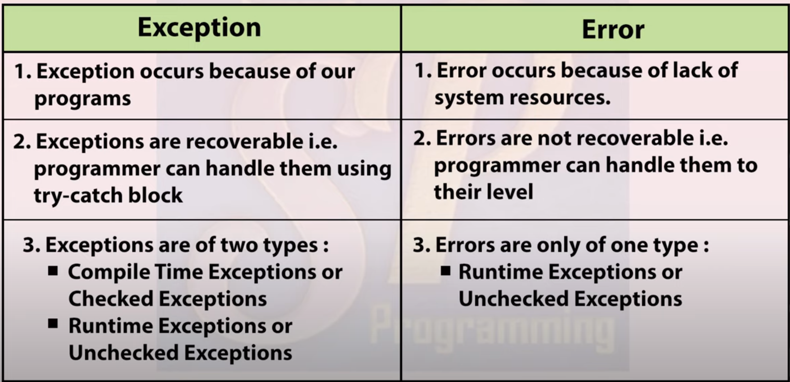
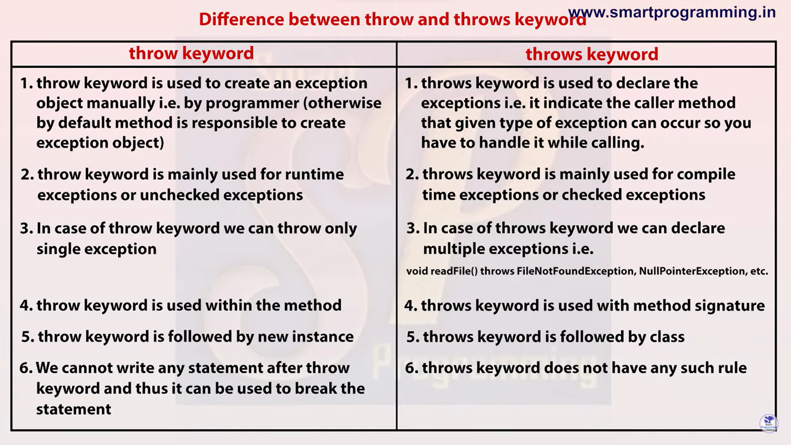

# Exception Handling

An Exception is an unwanted or unexpected event, which occurs during the execution of the program i.e at run time, that disrupts the normal flow of the program.

Exception Handling is one of the powerful mechanism to **handle** the runtime errors so that the normal flow of the application can be maintained.

```java

class Test{
    public static void main(String args[]){
        System.out.println("1");
        System.out.println("2");
        System.out.println("3");
        System.out.println("4");
        System.out.println(100/0);//Arithmetic Exception occur over here which disrupt the flow of the program the output will be 1 2 3 4 and error
        System.out.println("5");
        System.out.println("6");
        System.out.println("7");
    }
}

```

## Hierarchy of Exception class

- Object class is the parent class of all the class.
- Throwable is the parent class of the exception and the error.
- Exception can be divided into two part Compile time exception(Checked Exception) and Runtime exception(Unchecked Exception)


### Difference between exception and error



### Compile time exception.

- These exception are detected by the Java compiler before the program is executed.
- Example - ClassNotFoundException, FileNotFoundException.

```java

import java.io.FileInputStream;
class Test{
    public static void main(String args[]){
        FileInputStream fis = new FileInputStream("d:/abc.txt");//It will warn us about the exception before the program is executed during  compile time.
        //It can be fixed with try catch block
    }
}

```

### Runtime exception

- These exception are not checked by java compiler hence it will throws error only after execution.
- Example - ArithmeticException, IndexOutOfBoundException

```java
class Test {

    public static void main(String args[])
    {
        // Here we are dividing by 0
        // which will not be caught at compile time
        // as there is no mistake but caught at runtime
        // because it is mathematically incorrect
        int x = 0;
        int y = 10;
        int z = y / x;
    }
}
```


## try catch || Control flow in try catch

```java

class Test{
    public static void main(String args[]){
        int a = 100, b = 0, c;
        c = a/b;//Artithmetic Exception
        System.out.println(c);
    }
}

```

Whenever there is exception, the method in which exception occurs will create and object and that object will store three things.

- exception name
- description
- stack trace

Then this object will pass to JVM and then JVM will check if you are handling this exception or not if not then the program will abnormally terminate and the control will pass to the default exception handler which will print the details about the exception.

If we want to handle the exception manually then we can do that by using 5 keywords.

1. try
2. catch
3. finally
4. throw
5. throws

### try catch

**Syntax**

```java

try{
    //risky code
}
catch(ExceptionClassName ref.var.name){
    //handling code
}

```

```java
class Test{
    public static void main(String args[]){
        try{
            int a = 100, b = 0, c;
             c = a/b;//Artithmetic Exception
             System.out.println(c);
        }
        catch(Exeption e){// e strore the object data created by the method.
            System.out.println(e);
        }
        System.out.println("Hello");//Here as we handled the code properly using try catch block so the program will run properly and will not terminate abnormally and Hello will get printed.
    }
}

```

- e store the object data created by the method.
- If we know the name of the exception then we can pass as a argument in catch block otherwise just pass Exception class in the argument as it is the parent class of all the Exception class it will work fine.

### control flow of try catch.

```java
class Test{
    public static void main(String args[]){
        try{
            int a = 100, b = 0, c;
             c = a/b;//Artithmetic Exception
             System.out.println(c);
        }

        catch(Exeption e){// e strore the object data created by the method.
            System.out.println(e);
        }
        System.out.println("Hello");//Here as we handled the code properly using try catch block so the program will run properly and will not terminate abnormally and Hello will get printed.
    }
}

```

- If there is no exception in try block then catch block will not get executed. It will be skipped.

```java

class Test{
    public static void main(String args[]){
        System.out.println("1");
        try{
            System.out.println("2");
            int a = 100, b = 0, c;
            System.out.println("3");
             c = a/b;//Artithmetic Exception
             System.out.println("4");//This code will get skipped as there is exception before this line so the control will move directly to catch block.
             System.out.println(c);// This code also
        }
        catch(ArithmeticException e){// e strore the object data created by the method.
             System.out.println("5");
            System.out.println(e);
        }
        System.out.println("6");
    }
}

```

### Method to print exception information in java.

There are three ways by which we can print exception information in java.

1. e.printStackTrace()

   - It print Exception name, Description, Stack Trace

2. System.out.println(e) or System.out.println(e.toString())

   - It print Exception name and Description but not stack trace.

3. System.out.println(e.getMessage())

   - It will print only description but not Exception name and stack trace.

```java

class Test{
    public static void main(String args[]){
        try{
            int a = 100, b = 0, c;
            c = a/b;
            System.out.println(c);
        }
        catch(ArithmeticException e){
            e.printStackTrace(); //It prints Exception name, Description and Stack Trace.
            System.out.println(e); //It prints Exception name and Description only.
            System.out.println(e.getMessage()); //It print only description.
        }

    }

}

```

## finally block

In Java, a finally block is a piece of code that always runs, no matter what happens in a try block. Whether an exception is thrown or not, the finally block ensures certain actions are taken, like closing files or releasing resources. It's like a safety net that ensures important tasks are done, regardless of errors.

**Syntax**

```java
try{
    //risky code
    //file open
    //read write - If any exception occur while reading or writing the file then below code will not get executed so we provide closing code in finally block.
}
catch{
    //handling code
}
finally{
    //cleanup code
    //close
}

//We can also use finally without catch block

try{

}
finally{

}
```

- If exception occurs then control will move from try block to catch block and then finally block.
- If exception does not occur then controll will move from try block to directly finally block.

**Example**

```java

class Test{
    public static void main(String args[]){
        try{
            int a = 100, b = 0, c;
            c = a/b;
            System.out.println(c);
        }
        catch(ArithmeticException e){
            System.out.println(e);
        }
        finally{
            System.out.println("I am finally block");
        }
    }
}

```

```java
class Test{
    public static void main(String args[]){
        try{
            int a = 100, b = 0, c;
            c = a/b;
            System.out.println(c);
        }
        finally{
            System.out.println("I am finally block");//this block will get executed even if we dont handle the exception in the try block.
        }
        System.out.println("hello");//This will not get executed as after executing final block program will abnormally terminate.
    }
}

```

### Cleanup code using finally block.

```java
import java.sql.Connection;
import java.sql.PreparedStatement;
import java.sql.ResultSet;
import java.sql.SQLException;

class ConnectionCloseDemo{
    public static void main(String args[]){
        //Resource Opening
        Connection con = null;
        PreparedStatement ps = null;
        ResultSet rs = null;
        try{
            //do stuff
        }
        catch(Exception ex){
            //Exception handling stuff
        }
        finally{
            //Resource close
            try{
                rs.close();
            }
            catch(SQLException e){
                //Exception handling stuff
            }

            try{
                ps.close();
            }
            catch(SQLException e){
                //Exception handling stuff
            }

            try{
                con.close();
            }
            catch(SQLException e){
                //Exception handling stuff
            }
        }
    }
}
```

### Rules for finally block.

- We can use multiple catch block with one try block but we can use single finally block with one try block not multiple.
- The statement present in the finally block execute even if the try block contains control transfer statements(jump statement) like return break or continue.
- Cases where try block can't be used.
  - Using of the system.exit() method. In this case JVM will get shut down and finally block will not get executed.
  - Causing a fatal error that causes the process to abort. For example - Out of memory error.
  - Due to an exception arising in the finally and we are not handling it.
  - The death of the thread.

## Difference between final, finally and finalize.

### final

- It is a keyword.
- It can be used with
  - variable(value becomes constant) Example : final int a = 10;
  - class(it can't be inherited by other class)
  - method(does not override)

### finally

- It is a block.
- It is used with either try catch block or try block.
- It is mainly used to write cleanup code i.e if any resource is open then it can be used to close that resource.

### finalize

- It is a method.
- Method is overriden for an object.
- Syntax

```java
protected void finalize() throws Throwable{
    //cleanup code
}
```

- This method can be overriden.
- It is method which get executed before the garbage collection.

## Various possible combination of try catch finally

- Order Matters: When using multiple catch blocks, they must be ordered from most specific to least specific. This means that more specific exception types should be caught before more general ones. If you catch a more general exception type before a more specific one, the specific catch block will never be reached because the more general catch block will handle the exception first.

- We cant provide same class exception in catch block

```java

try{

}
catch(ArithmeticException e){ // Specific exception type

}
catch(Exception a){ // More general exception type
//We cant use ArithmeticException in this catch block as it already handled previously

}

```

- We can use try-catch blocks inside other try, catch, and finally blocks in Java.

```java
try{
    try{

    }
    catch(Exception e){

    }
}
catch(Exception a){
    try{

    }
    catch(Exception b){

    }
}

```

- We cant use catch block after try and finally block

```java
//This is not possible it will give error
try{

}
finally{

}
catch(Exception a){

}
```

- We cant write any statement between try and catch block.

```java
//This is not possible it will give error
try{

}
System.out.println("hello");//no statement
catch(Exception a){

}
```

## throw

**How JVM handle exception??**

Default Exception Handling: Whenever inside a method, if an exception has occurred, the method creates an Object known as an Exception Object and hands it off to the run-time system(JVM). The exception object contains the name and description of the exception and the current state of the program where the exception has occurred. Creating the Exception Object and handling it in the run-time system is called throwing an Exception. There might be a list of the methods that had been called to get to the method where an exception occurred. This ordered list of methods is called Call Stack. Now the following procedure will happen.

- The run-time system searches the call stack to find the method that contains a block of code that can handle the occurred exception. The block of the code is called an Exception handler.
- The run-time system starts searching from the method in which the exception occurred and proceeds through the call stack in the reverse order in which methods were called.
- If it finds an appropriate handler, then it passes the occurred exception to it. An appropriate handler means the type of exception object thrown matches the type of exception object it can handle.
- If the run-time system searches all the methods on the call stack and couldn’t have found the appropriate handler, then the run-time system handover the Exception Object to the default exception handler, which is part of the run-time system. This handler prints the exception information in the following format and terminates the program abnormally.

```java
class Test{
    public static void main(String args[]){
        Test t = new Test();
        t.divide();
    }
    void divide(){
        int a = 100, b = 0, c;
        c = a/b;//here the method will create an object and hand it will it to the JVM. Here JVM will check if it is handled or not if not then it will move upward in the call stack and check where the method is called.
        System.out.println(c);
    }
}
```

**Syntax**

```java
throw new ExceptionClassName("");
```

**Program**

```java
class Test{
    public static void main(){
        throw new ArithmeticException();//It will also throw exception but in this the exception object is created by the user and will pass to the JVM. There is no main method involved in it.
        //throw keyword cannot be used for predefined exception it is used for custom exception though i have used it and it will compile fine but its not good practice
    }
}
```

The throw keyword in Java is used to explicitly throw an exception from a method or any block of code. We can throw either checked or unchecked exception. The throw keyword is mainly used to throw custom exceptions.

throw keyword is mainly used for custom exception.

**How to create exception class and custom exception?**

```java
class YoungAgeException extends RuntimeException{
    YoungAgeException(String msg){
        super(msg);
    }
}
class Voting{
    public static void main(String args[]){
        int age = 16;
        if(age < 18){
            throw new YoungAgeException("You are not eligible for voting");//with the help of throw keyword excpetion object will be created in which there will be three thing class name, description and stack trace.
            //class name = YoungAgeException
            //description = "You are not eligible for voting"
            //stack tract = line number
            //We cannot write any statement after throw statement.
        }
        else{
            System.out.println("Thank you for voting");
        }
        //this will terminate the program abnormally throw keyword only create exception object manually and pass it to the jvm, to handle exception we have to use try catch block over here
    }
}
```


## throws

"throws" keyword is used to declare an exception. It gives information to the caller method that there may occur and exception so its better for the caller method to provide the exception handling code so the normal flow of the code can be maintaned.

throws keyword can be used only in case of checked exception. If there occurs any unchecked exception such as NullPointerException, it is programmer fault that he is not performing check up before the code being used.

```java
import java.io.FileInputStream;
import java.io.FileNotFoundException;
import java.io.FileOutputStream;
class ReadAndWrite{
    void readFile() throws FileNotFoundException{//throws keyword just indicate the caller method about the exception which might occur and to handle it
        FileInputStream fis = new FileInputStream("d:/abc.txt");
    }
    void saveFile() throws FileNotFoundException{
        FileOutputStream fos = new FileOutputStream("d:/xyz.txt");
    }
}
class Test{
    public static void main(String args[]){//here main method is the caller method
        ReadAndWrite rw = new ReadAndWrite();
        try{
            rw.readFile();//we handled the exception with the help of the try catch block so that no exception occur.
        }
        catch(FileNotFoundException e){
            e.printStackTrace();
        }
        System.out.println("hello");//Execution successful no abormal termination
    }
}
```


## Difference between throw and throws



## Customized Exception or User defined exception

- We can create both checked and unchecked exception.
- To create Checked Exception(Compile time exception) we need to inherit Exception class.
- To create Unchecked Exception(Runtime Exception) we meed to inherit RuntimeException class.

**Checked Exception**

```java
class UnderAgeException extends Exception{
    UnderAgeException(){
        super("You are under age");
    }
    UnderAgeException(String message){//This is the message provided by the user.
        super(message);//super keyword is used to provide description to default exception handler
    }
}
class Voting{
    public static void main(String args[]){
        int age = 17;
        try{
            if(age < 18){
            throw new UnderAgeException();
        }
        else{
            System.out.println("You are eligible to vote");
        }
        }
        catch(UnderAgeException e){
            e.printStackTrace();
        }

    }
}
```

**Unchecked Exception**

```java
class UnderAgeException extends RuntimeException{
    UnderAgeException(){
        super("You are under age");
    }
    UnderAgeException(String message){//This is the message provided by the user.
        super(message);//super keyword is used to provide description to default exception handler
    }
}
class Voting{
    public static void main(String args[]){
        int age = 17;
        try{
            if(age < 18){
            throw new UnderAgeException();//if we dont handle the exception then the program will compile but will not get executed as the exception object will pass to the default exception handler and it will terminate the main method abnormally.
        }
        else{
            System.out.println("You are eligible to vote");
        }
        }
        catch(UnderAgeException e){
            e.printStackTrace();
        }
        System.out.println("hello");

    }
}

```
