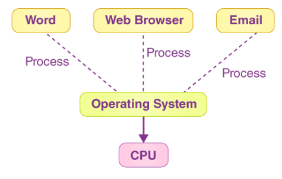
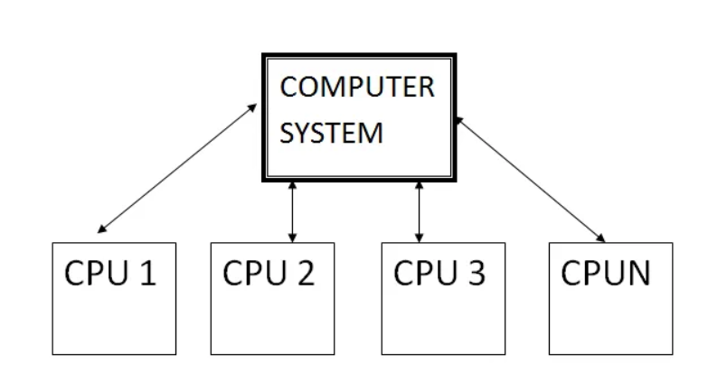
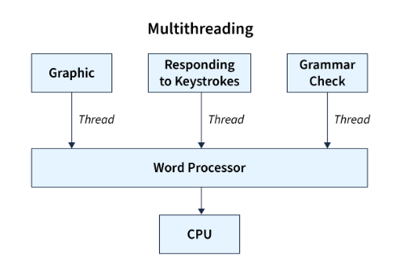
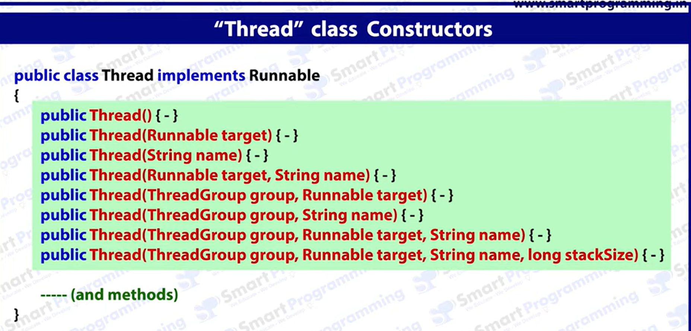
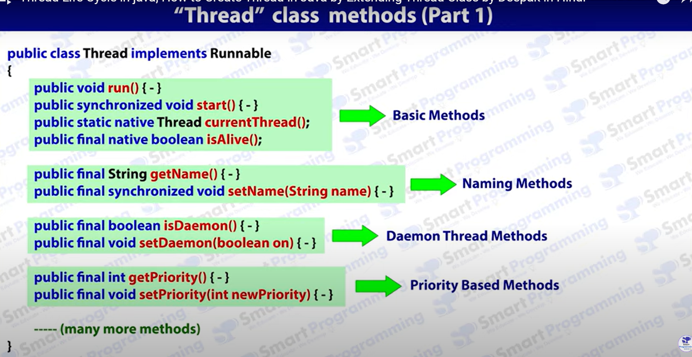
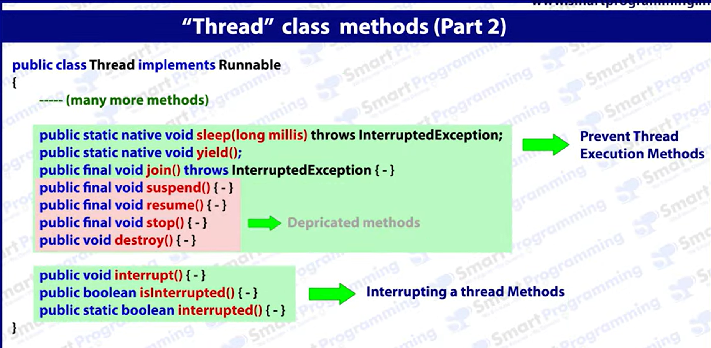
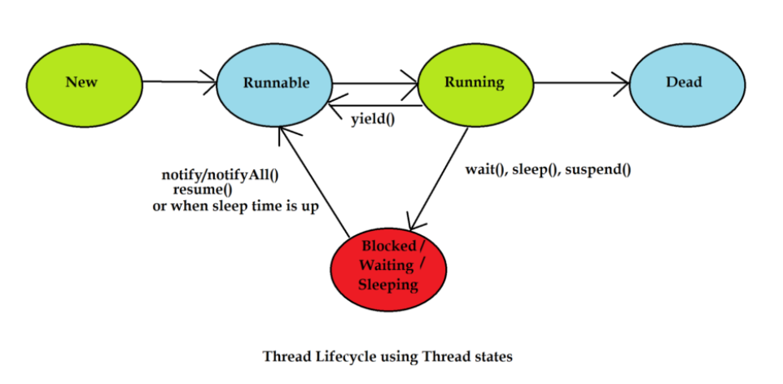
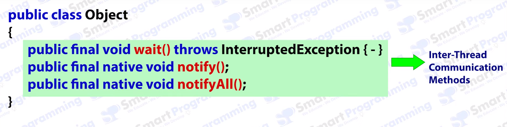
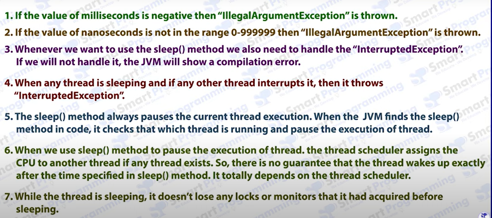

# Multithreading

## Difference between Multitasking, Mutliprocessing and Multithreading

### Multitasking

- Multitasking refers to the ability of a computer system to execute multiple tasks or processes concurrently.

- It increase the performance of the CPU.



- Two ways by which we can achive multiprocessing.
  - Process based Multitasking(MP)
  - Thread based Multitasking(MT)

### Multiprocessing

- When one system is connected to multiple processor in order to complete the task.



- It is best suitable at system level or OS level.

### Multithreading

- Executing multiple threads(sub process) at single time.



- Multi-threading is best suitable at programming level.

- It is mainly used in softwares, games and animation.

- JAVA provide pre-defined API for multi-threading.

  - Thread
  - Runnable
  - Thread Group
  - Concurrency
  - Thread Pool

Example

```java

VLC ( process, program )

class VLC
{
     public static void main(String[] args)
        {
               Video vid = new Video();
               vid.playvideo();
               Music mus = new Music();
               mus.playmusic();
        }
}

class Video   //Thread 1
{
      void playvideo()
          {
              //implementation
          }
}

class Music  //Thread 2
{
      void playmusic()
          {
              //implementation
          }
}

```

## Difference between process and thread.

### Process

- A program which is in executing state.
- Process is heavy weight because it contains thread also.
- Process takes more time in context switching(A context switching is a process that involves switching of the cpu from one process to another. In this phenomenon, the execution of the process that is present in the running state is suspended by the kernel and another process that is present in the ready state is executed by CPU)
- It takes more time in interprocess communication.
- Each process has different address space.
- Process are not dependent on each other.
- Process does not require Synchronization.
- Process consume more resource.
- Process takes more time for creation.
- Process require more timem for temination.

### Thread

- It is a subpart of a program.
- Thread is light weight.
- Context switching takes less time.
- It takes less time in interthread communication.
- Thread share same address space.
- Thread are dependent on each other.
- Thread may require Synchronization.
- Thread consume less resource.
- Thread require less time for creation.
- Thread require less time for termination.

## Thread life cycle. How to create threads?

There are two ways to create thread.

- Thread(class)
- Runnable(Interface)

Thread is a predefined class created by java which is in java.lang package. It consists of constructor and methods.

```java
class Thread{
    //constructor
    //method
    run();
    start();
    sleep();
    join();
    getName(); and setName();
    interrupted priority
    daemon
}
```

Examples of Constructor and methods in thread class.







### Steps to create thread.

```java
//Step 1: Extends the thread class
class Test extends Thread{
    //Step 2: Override the run method
    public void run(){
        //thread task
    }
    public static void main(String args[]){
        //Step 3: Create an object of the class
        Test t = new Test();
        //Step 4: Start the thread using start() method
        t.start();

    }
}
```

### Thread life cycle.



**New**

- When a thread object is created using new keyword, it is in a state that is called ‘New’ state. At this moment, only an object is created in the JVM. Please note that the thread hasn’t started working yet.

**Runnable**

- Remember the statment t.start(); ? We used this to start a thread, right? So, does the thread start when this method is called on it? The answer is no. start() method call only ensures that the thread is registered in a pool of threads which is refered by the Thread scheduler to run a particular thread.

- This thread pool is called Runnable pool, and the threads which are there in this pool are known to be in Runnable state.

- In this state, thread is runnable, meaning it can be picked up by the thread scheduler to run any time. But the thread is still not running.

**Running**

- A thread is said to be in this state when the thread is actully running its run() method code.

**Blocked/Waiting/Sleeping**

- A thread which is running can be pushed to one of the three states: Blocked/Waiting/Sleeping.

- Blocked state is the one in which a thread is blocked for some resource or a lock which is already acquired by another thread.

- Waiting state is the one in which a thread goes after calling wait() method.

- Sleeping state is the one in which a thread goes after calling sleep() method.

- All these 3 states are clubbed as one state because they are more or less similar. In any of these states, the thread is not eligible for running.

Note -> Once a thread goes back from any of these states, it doesn’t start running immediately. Rather it goes back to runnable pool of threads where it is upto the scheduler when that thread will be picked to run.

**Terminated or Dead**

- A thread goes to Terminated or Dead state when it completes its run() method execution. Once dead, a thread cannot be run again. If someone tries to start a dead thread, then an IllegalThreadStateException is thrown.

## How to create thread using Thread class and Runnable interface.

There are two ways by which we can create thread:

- Thread(Class)
- Runnable(Interface)

Thread class

- It is in package.java.lang
- It consist of many constructor and method.
- Thread class implements runnable interface.

```java
class Thread implements Runnable{
    //constructor
    //method
    run();

}

```

**Example**

```java
//Step 1: Extends the thread class
class Test extends Thread{
    //Step 2: Override the run method
    public void run(){
        System.out.println("Thread task");//thread task
    }
    public static void main(String args[]){
        //Step 3: Create an object of the class
        Test t = new Test();
        //Step 4: Start the thread using start() method
        t.start();
        //We cant invoke the start() method again.

    }
}
```

Runnable Interface

- It is in package.java.lang package.
- It consist of only one method which is run().

```java
public interface Runnable{
    //method
    run()
}
```

**Example**

```java
//Step 1: Implements the runnable interface
class Test implements Runnable{
    //Step 2: Override the run() method.
    public void run(){
        System.out.println("Thread task");//Thread task
    }
    public static void main(String args[]){
        //Step 3: Create an object of Test class
        Test t = new Test();
        //Step 4: Create an object of thread class and pass referce of test class in it.
        Thread th = new Thread(t);
        //Step 5: Invoke the thread.
        th.start();
    }
}
```

## Differenct cases of executing thread in java.

**1. Performing single task from single thread.**

```java

class Test extends Thread{
    public void run(){
        System.out.println("Thread task");//thread task
    }
    public static void main(String args[]){
        Test t = new Test();//Created one thread to execute one thread task
        t.start();
    }
}

```

**2. Performing single task from multiple thread.**

```java

class Test extends Thread{
    public void run(){
        System.out.println("Thread task");//thread task
    }
    public static void main(String args[]){//this is the main thread created by JVM.
        Test t = new Test();//thread 1
        t.start();
        Test t2 = new Test();//thread 2
        t2.start();
        //2 thread to perfom one task
    }
}

```

**3. Performing multiple task from single thread**

It is not possible because one thread can perform one task only.

**4. Performing multiple task from multiple thread**

```java
class MyThread1 extends Thread{
    public void run(){
        System.out.println("Thread1");//Task 1
    }
}
class MyThread2 extends Thread{
    public void run(){
        System.out.println("Thread2");//Task 2
    }
}
class Test{
    public static void main(String args[]){
        MyThread1 t1 = new MyThread1();//Thread 1
        t1.start();
        MyThread2 t2 = new MyThread2();//Thread 2
        t2.start();
        //All the thread gets executed simultaneously
    }
}
```

## Thread class methods and constructor.

### Thread constructor.

**Basic constructor**

- Thread()
- Thread(Runnable target)
- Thread(String name)
- Thread(Runnable target,String name)

**ThreadGroup constructor**

- Thread(ThreadGroup tg, Runnable target)
- Thread(ThreadGroup tg, String name)
- Thread(ThreadGroup tg, Runnable target, String name)
- Thread(ThreadGroup tg, Runnable target, String name, long stackSize)

### Thread methods.

**Basic Method**

- public void run(): is used to perform action for a thread.
- public void start(): starts the execution of the thread.JVM calls the run() method on the thread.
- public Thread currentThread(): returns the reference of currently executing thread.
- public boolean isAlive(): tests if the thread is alive.

**Naming Method**

- public String getName(): returns the name of the thread.
- public void setName(String name): changes the name of the thread.

**Daemon thread Method**

- public boolean isDaemon(): tests if the thread is a daemon thread.
- public void setDaemon(boolean b): marks the thread as daemon or user thread.

**Priority based method**

- public int getPriority(): returns the priority of the thread.
- public int setPriority(int priority): changes the priority of the thread.

**Preventing thread execution method**

- public void sleep(long miliseconds): Causes the currently executing thread to sleep (temporarily cease execution) for the specified number of milliseconds.
- public void yield(): causes the currently executing thread object to temporarily pause and allow other threads to execute.
- public void join(): waits for a thread to die.
- public void join(long miliseconds): waits for a thread to die for the specified miliseconds.

**Depreceated Method**

- public void suspend(): is used to suspend the thread(depricated).
- public void resume(): is used to resume the suspended thread(depricated).
- public void stop(): is used to stop the thread(depricated).

**Interrupting the thread method**

- public void interrupt(): interrupts the thread.
- public boolean isInterrupted(): tests if the thread has been interrupted.
- public static boolean interrupted(): tests if the current thread has been interrupted.

**Inter thread communication method**



## Programs of methods of Thread class.

**Program 1**

```java
public class ThreadNameDemo{
    public static void main(String args[]){
        System.out.println("Hello");
        System.out.println(Thread.currentThread().getName());//Output- main
        Thread.currentThread().setName("Ashish");
        System.out.println("New Thread Name " + Thread.currentThread().getName());//Ashish
        System.out.println(10/0);//Output - Exception in thread "Ashish" java.lang.ArithmeticException: / by zero
   }
}
```

**Program 2**

```java
public class Test extends Thread{
    public void run(){//thread - 0
        System.out.println("Thread task : " + Thread.currentThread().getName());//Thread - 0
        //Ashish
    }
    public static void main(String args[]){//main thread
        System.out.println("Hello : " + Thread.currentThread().getName());//main
        Test t1 = new Test();
        t1.start();
        Test t2 = new Test();
        t2.setName("Ashish");
        t2.start();
    }
}
```

## Daemon thread

- Daemon threads are low-priority threads that run in the background.
- It provides services to the user thread.
- It performs background operations such as garbage collection, finalizer, Action Listeners, Signal dispatches, etc.
- Example - Spelling checker in ms word which run in the backgroud and check spelling of the word.

**Methods**

- public final void setDaemon(boolean b) - It is used to set the thread as daemon
- public final boolean isDaemon() - It checks whether the thread is daemon or not

**Program 1**

```java
class Test extends Thread{
    public void run(){
        System.out.println("Child Thread");
    }
    public static void main(String args[]){
        System.out.println("Main method");//without this line the daemon thread will not run as daemon thread provide service to the main thread so if this line does not exist there will be nothing to execute in the main method so there is no need of daemon method.
        Test t = new Test()
        t.setDaemon(true);
        t.start();
    }
}

```

**Important point to remember**

- We have to create daemon thread before starting the thread, If we create daemon thread after starting it, it will throw runtime exception i.e IllegalThreadStateException.

- We cannot create main thread as daemon thread because because the main thread will be created and started by JVM and if you would like to mark it as a daemon thread you have to write the below line inside the main method, that means the thread already started hence it will throw the above exception.

- It's life depend on another thread.

- It inherit the properties from its parent thread. For example - If a thread is created by another thread and the parent thread is a daemon, the child thread inherits this status. However, if the parent thread is not a daemon, you need to explicitly mark the thread as a daemon.

- Daemon threads are not essential for the JVM to continue running. If the only threads executing are daemon threads, the JVM may decide to terminate them, which means daemon threads can't be relied upon for critical tasks.

- By default priorties of daemon thread is low.

## Thread Priorities

- JVM provides the priority to each thread and according to these priorities JVM allocates the processor.

- Priorites are represented in the form of integer values which ranges from 1 to 10.

  - 1 - MIN_PRIORITY
  - 5 - NORM_PRIORITY
  - 10 - MAX_PRIORITY

- Methods:
  - public final void setPriority(int value)
  - public final int getPriority()

```java
public class Test extends Thread{
    public void run(){
        System.out.println("Thread task");
        System.out.println("Child thread new priority"+Thread.currentThread().getPriority());//It will inherit the priority of main thread which is 10
    }
    public static void main(String args[]){
        System.out.println("Main thread old priority "+Thread.currentThread().getPriority());//by default priority of main thread is 5
        Thread.currentThread().setPriority(10);
        System.out.println("Main thread new priority "+Thread.currentThread().getPriority());
        Test t = new Test();
        t.start();
    }
}
```

**Important point to remember**

- Priorities are inherited from parent thread.
- By default main thread priority is 5.
- If priority value is not between 1 to 10 then it will throw runtime exception i,e IllegalArgumentException.
- If multiple thread priorities is same then we cant assume which will get executed firstly and lastly. It is handled by JVM algorithm.
- Windows don't support priorities.

## sleep() method.

- The sleep() method is a static method of Thread class and it makes the thread sleep/stop working for a specific amount of time.
- The sleep() method throws an InterruptedException if a thread is interrupted by other threads, that means Thread.sleep() method must be enclosed within the try and catch blocks or it must be specified with throws clause.

**Methods**

- public static native void sleep(long milliseconds) throws Interrupted Exception
- public static void sleep(long milliseconds, int nanoseconds) throws Interrupted Exception.

**Program 1**

```java
class Test{
    public static void main(String args[]){
        for(int i = 1; i <= 5; i++){
            try{
                Thread.sleep(1000);//Main thread will go in sleep mode for 1 sec every time loops get executed.
                System.out.println(i);
            }
            catch(Exception e){
                System.out.println(e);
            }
        }
    }
}
```

**Program 2**

```java
class Test extends Thread{
    public void run(){
        for(int i = 1; i <= 5; i++){
            try{
                Thread.sleep(1000);//Main thread will go in sleep mode for 1 sec every time loops get executed.
                System.out.println(i);
            }
            catch(Exception e){
                System.out.println(e);
            }
        }
    }
    public static void main(String args[]){
        Test t = new Test();
        t.start();
    }
}
```



## sleep method cases

**Case 1 : When multiple thread perfrom sleep method**

```java

class Test extends Thread{
    public void run(){
        for(int i = 1; i <= 5; i++){
            try{
                System.out.println(i + " : " + Thread.currentThread().getName());
                Thread.sleep(1000);
            }
            catch(Exception e){
                System.out.println(e);
            }
        }
    }
    public static void main(String args[]){
        Test t1 = new Test();
        t1.start();

        Test t2 = new Test();
        t2.start();
    }
}

//Output

/*
1 : Thread-1
1 : Thread-0
2 : Thread-1
2 : Thread-0
3 : Thread-1
3 : Thread-0
4 : Thread-1
4 : Thread-0
5 : Thread-1
5 : Thread-0
*/
```

In thi program both the thread get executed simultaneously and will take only 5 second.

**Case 2: When we use run() method instead of start() method**

```java

class Test extends Thread{
    public void run(){
        for(int i = 1; i <= 5; i++){
            try{
                System.out.println(i + " : " + Thread.currentThread().getName());
                Thread.sleep(1000);
            }
            catch(Exception e){
                System.out.println(e);
            }
        }
    }
    public static void main(String args[]){
        Test t1 = new Test();
        t1.run();

        Test t2 = new Test();
        t2.run();
    }
}

//Output

/*
1 : main
2 : main
3 : main
4 : main
5 : main
1 : main
2 : main
3 : main
4 : main
5 : main
*/

```

In this program both the object will execute the method separately and it will take 10 second to execute completly.
