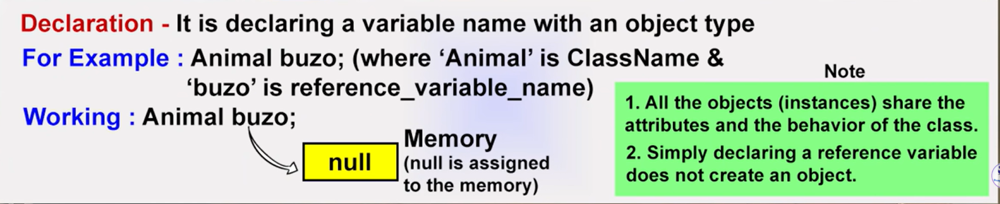
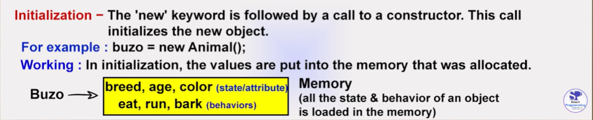

# OOPS

- Object Oriented Programming System/Structure.
- OOPS is a Programming paradigm or methodology.
- Paradigm can also be termed as method to solve some problem or to do some tasks. Programming paradigm is an approach to solve problem using programming language or also we can say it is a method to solve a problem using tools and technique that are available to us following some approach.
- Programming paradigm are of different types.
  - Object Oriented paradigm.
  - Procedural paradigm.
  - Functional paradigm.
  - Logical paradigm.
  - Structred paradigm.
- 6 main pillars of OOPS are.
  - Class
  - Object and method
  - Inheritance
  - Polymorphism
  - Abstraction
  - Encapsulation

## Class

- Class is the collection of Object.
- Class is not a real world entity , it is just a template or blueprint or prototype.
- Class does not occupy memory.

**Syntax** - access-modifier class ClassName {

}

\*A class can have method, constructor, variable, blocks and nested class.

## Method

- A set of codes which perform a particular task

**Advantages of Method**

- Code reusability
- Code optimization

**Syntax**

access-modifier return-type methodName(list of parameters){

}

## Object

- Object is an instance of class.
- Object is a real world entity hence it occupies memory.
- Object consist of :-
  - Identity - name
  - State/Attribute - color, breed, age (represents variable)
  - Behaviour - eat, run, bark (represents method)

How to create an object?

- new keyword
- newInstance() method
- clone() method
- deserialization
- factory method

How to create object with the help of new keyword?

Declaration - Animal buzo;


Instantiation - buzo = new (new keyword is used to allocate memory)


Initialization - Animal buzo = new Animal(); (We initialize by creating constructor same as class name)


Animal buzo = new Animal();

To call the method or intialize the attribute of the object we use . operator

Example - buzo.run(); buzo.color = "black";

```java
public class Animal {
    public void eat(){
      System.out.println("I am eating");
    }
    public static void main(String[] args) { //there will be only one main method in the program
        System.out.println("1");
        Animal dog = new Animal();
        dog.eat();
        dog.run();
        Birds sparrow = new Birds();// to execute method of other class we have to make object of that class
        sparrow.fly();
    }
    public void run(){
      System.out.println("I am running");
    }
}
class Birds{
          void fly (){
            System.out.println("I am flying");
          }
}
```

Three ways by which we can initialize object -

1. Using reference variable

```java
class Animal{
     String color;
     int age;
     public static void main(String[] args){
      Animal dog = new Animal();
      dog.color = "white";
      dog.age = 5;
      System.out.println("Dog is " + dog.color + "and his age is " + dog.age);
     }
}
```

2. Using Method

```java
class Animal{
     String color;
     int age;
     void intObj(String c,  int a){
          color = c;
          age = a;
     }
     void display(){
        System.out.println("Dog is " + color + " and his age is " + age);
     }
     public static void main(String args[]){
      Animal dog = new Animal();
      dog.intObj("white", 5);
      dog.display();
     }
}
```
