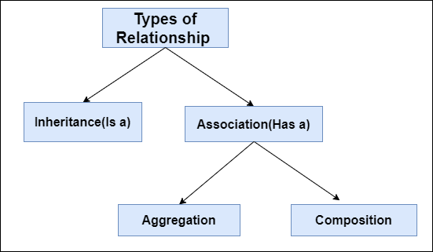
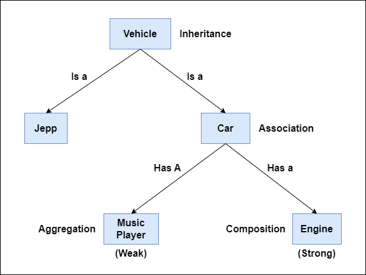
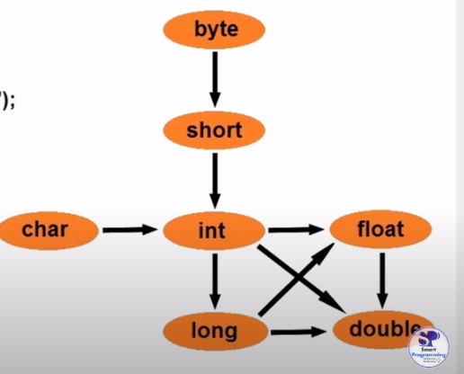

# OOPS

- Object Oriented Programming System/Structure.
- OOPS is a Programming paradigm or methodology.
- Object-Oriented Programming (OOP) is a programming paradigm based on the concept of "objects", which can contain data (attributes or properties) and behavior (methods). It is used to structure software programs into simple, reusable blueprints (called classes), which are then used to create objects (instances of classes).
- Programming paradigm are of different types.
  - Object Oriented paradigm.
  - Procedural paradigm.
  - Functional paradigm.
  - Logical paradigm.
  - Structred paradigm.
- 6 main pillars of OOPS are.
  - Class
  - Object and method
  - Inheritance
  - Polymorphism
  - Abstraction
  - Encapsulation

## Class

- Class is the collection of Object.
- Class is not a real world entity , it is just a template or blueprint or prototype.
- Class does not occupy memory.

**Syntax** - access-modifier class ClassName {

}

- A class can have method, constructor, variable, blocks and nested class.

## Method

- A set of codes which perform a particular task

**Advantages of Method**

- Code reusability
- Code optimization

**Syntax**

access-modifier return-type methodName(list of parameters){

}

## Object

- Object is an instance of class.
- Object is a real world entity hence it occupies memory.
- Object consist of :-
  - Identity - name
  - State/Attribute - color, breed, age (represents variable)
  - Behaviour - eat, run, bark (represents method)

How to create an object?

- new keyword
- newInstance() method
- clone() method
- deserialization
- factory method

How to create object with the help of new keyword?

Declaration - Animal buzo;


Instantiation - buzo = new (new keyword is used to allocate memory)


Initialization - Animal buzo = new Animal(); (We initialize by creating constructor same as class name)


Animal buzo = new Animal();

To call the method or intialize the attribute of the object we use . operator

Example - buzo.run(); buzo.color = "black";

```java
public class Animal {
    public void eat(){
      System.out.println("I am eating");
    }
    public static void main(String[] args) { //there will be only one main method in the program
        System.out.println("1");
        Animal dog = new Animal();
        dog.eat();
        dog.run();
        Birds sparrow = new Birds();// to execute method of other class we have to make object of that class
        sparrow.fly();
    }
    public void run(){
      System.out.println("I am running");
    }
}
class Birds{
          void fly (){
            System.out.println("I am flying");
          }
}
```

Three ways by which we can initialize object -

1. Using reference variable

```java
class Animal{
     String color;
     int age;
     public static void main(String[] args){
      Animal dog = new Animal();
      dog.color = "white";
      dog.age = 5;
      System.out.println("Dog is " + dog.color + "and his age is " + dog.age);
     }
}
```

2. Using Method

```java
class Animal{
     String color;
     int age;
     void intObj(String c,  int a){
          color = c;
          age = a;
     }
     void display(){
        System.out.println("Dog is " + color + " and his age is " + age);
     }
     public static void main(String args[]){
      Animal dog = new Animal();
      dog.intObj("white", 5);
      dog.display();
     }
}
```

3. Using Constructor

## Constructor

- Constructor is block similar to method having same name as that of class name.
- Constructor does not have any return type not even void.
- The only modifier applicable for constructor are public, protected, default and private.
- It executes automatically when we create object.

```java
class Employee{
  String name;
  int emp_id;
  Employee(String name, int emp_id){//used constructor to initialize the instance variable of the object.
    this.name = name;
    this.emp_id = emp_id;
  }
  public static void main(String args[]){
    Employee e1 = new Employee("Ashish", 12);
    Employee e2 = new Employee("Rahul", 14);
    System.out.println(e1.name);
  }
}
```

### Types of Constructor

1. Default Constructor

- It is created by compiler.

```java
class Test{
  int a;
  Test(){
    super();
  }
  public static void main(String args[]){
    Test t = new Test();
    System.out.println(t.a);//a = 0 (default value)
  }
}
```

2. No-arg Constructor(User defined)

```java
class Test{
  Test(){//It is created by the user.
    System.out.println("No argument constructor");
  }
  public static void main(String args[]){
    Test t = new Test();
  }
}
```

3. Parametrized Constructor

```java
class Test{
  Test(String name){
    System.out.println("Parametrized Constructor");
  }
  public static void main(String args[]){
    Test t = new Test("Ashish");
  }
}
```

## Inheritance

- Inheritance is a mechanism that allows a new class to inherits all the properties and behaviors of the existing class, and can also add its own properties and behaviors.
- We achive inheritance by using **extends** keyword.

```java
class Animal{// parent class or super class
  void eat(){
    System.out.println("I am eating");
  }
}
class Dog extends Animaml{// child class or sub class
  public static void main(String args[]){
    Dog d = new Dog();
    d.eat();
  }
}
```

Dog **Is A** Animal (**is a** relationship)

**Advantages of Inheritance**

- Code reusability.
- It promotes runtime polymorphism by allowing method overriding.

**Disadvantages of Inheritance**

- Tight Coupling -: Inheritance can lead to tight coupling between classes, where changes in one class (especially in the superclass) can have unforeseen consequences on subclasses.

### Types of Inheritance

1. Single Inheritance - A class inherit from only one super class.

```java
class Animal {
    void eat() {
        System.out.println("Animal is eating");
    }
}

class Dog extends Animal {
    void bark() {
        System.out.println("Dog is barking");
    }
}

public class Main {
    public static void main(String[] args) {
        Dog dog = new Dog();
        dog.eat(); // Inherits from Animal class
        dog.bark(); // Method defined in Dog class
    }
}
```

2. Multilevel Inheritance - In multilevel inheritance, a class inherits from another class, and that class, in turn, can act as a superclass for another class.

```java
// Example of Multilevel Inheritance
class Animal {
    void eat() {
        System.out.println("Animal is eating");
    }
}

class Dog extends Animal {
    void bark() {
        System.out.println("Dog is barking");
    }
}

class Puppy extends Dog {
    void wagTail() {
        System.out.println("Puppy is wagging its tail");
    }
}

public class Main {
    public static void main(String[] args) {
        Puppy puppy = new Puppy();
        puppy.eat(); // Inherits from Animal class
        puppy.bark(); // Inherits from Dog class
        puppy.wagTail(); // Method defined in Puppy class
    }
}
```

3. Hierarchical Inheritance: In hierarchical inheritance, multiple classes inherit from a single superclass.

```java
class Animal {
    void eat() {
        System.out.println("Animal is eating");
    }
}

class Dog extends Animal {
    void bark() {
        System.out.println("Dog is barking");
    }
}

class Cat extends Animal {
    void meow() {
        System.out.println("Cat is meowing");
    }
}

public class Main {
    public static void main(String[] args) {
        Dog dog = new Dog();
        dog.eat(); // Inherits from Animal class
        dog.bark(); // Method defined in Dog class

        Cat cat = new Cat();
        cat.eat(); // Inherits from Animal class
        cat.meow(); // Method defined in Cat class
    }
}

```

**Important points of Inheritance**

- There is no multiple inheritance and hybrid inheritance in java.
- If any class doest not inherit any other class it will indirectly inherit Object class.
- Object class is the parent class of all the class.
- Below does not take part in inheritance.
  - Constructors - A subclass inherit all the members(fields, method and nested class) from its super class. Constructors are not members so they are not inherited by subclasses, but the constructor of the super class can be invoked from the subclass.
  - Private member - A sublcass does not inherit private member of its parent class.

### Relationship between classess.

There are two types of relation



**Advantages**

1. Code reusability
2. Cost cutting
3. Reduce redundancy

### Inheritance

```java
class Vehicle{

}
class Car extends Vehicle{

}
```

Car Is A Vehicle (Is A relationship)

- In this realtion both classes are tightly coupled that means if we make changes in the first class second class also get affected.

### Association

```java
class Department {
    String deptName;

    Department(String deptName) {
        this.deptName = deptName;
    }

    void showDept() {
        System.out.println("Department: " + deptName);
    }
}

class Student {
    String name;
    Department dept;  // Aggregation (Student has-a Department)

    Student(String name, Department dept) {
        this.name = name;
        this.dept = dept;
    }

    void showDetails() {
        System.out.println("Student: " + name);
        dept.showDept();  // using Department's method
    }

    public static void main(String[] args) {
        Department d = new Department("Computer Science");  // created separately
        Student s = new Student("Ashish", d);  // passed as reference

        s.showDetails();
    }
}

```

Student **Has A** department(Has a relation)

```java
class Engine {
    void start() {
        System.out.println("Engine is started.");
    }
}

class Car {
    private Engine engine;  // Car "has-a" Engine (composition)

    public Car() {
        engine = new Engine();  // Car creates the Engine
    }

    public void startCar() {
        engine.start();  // Use Engine's method
        System.out.println("Car has started.");
    }
}

public class Main {
    public static void main(String[] args) {
        Car myCar = new Car();  // Creating Car also creates Engine
        myCar.startCar();
    }
}


```

Car **Has a** Engine

- Classes are not tightly coupled that means we can use required properties of engine class with the help of reference object.

**Aggregation:**

Aggregation is a "has-a" relationship where one class, often called the container or parent class, contains references to another class, often called the contained or child class. The contained class is not dependent on the container class, meaning it can exist independently. Aggregation is a weaker form of association compared to composition.

**Composition**

Composition is a stronger form of association where one class, the composite, contains an instance of another class, the component, and the component cannot exist without the composite. In other words, the lifetime of the component is managed by the composite.



## Polymorphism

- Polymorphism in Java is a concept by which we can perform a single action in different ways.
- The word "poly" means many and "morphs" means forms.

### Types of polymorphism

**1. Compile Time Polymorphism**

- It is also known as static polymorphism.
- We can achive compile time polymorphism by method overloading.
- It is handle by compiler.

**2. Run Time Polymorphism**

- It is also known as dynamic polymorphism.
- We can achive run time polymorphism by method overriding.
- It is handle by JVM.

### Method Overloading

- Method name should be same.
- Method should belong to same class.
- Argument should be different.
  - Number of argument should be different.
  - Sequence of argument should be different.
  - Type of argument should be different.

```java
public class Calculator {

    public int add(int a, int b) {
        return a + b;
    }

    // Number of argument is different
    public int add(int a, int b, int c) {
        return a + b + c;
    }

    // Type of argument is different
    public String add(String a, String b) {
        return a + b;
    }


    public static void main(String[] args) {
        Calculator calculator = new Calculator();

        // Adding two integers
        int sum1 = calculator.add(10, 20);
        System.out.println("Sum of two integers: " + sum1);

        // Adding three integers
        int sum2 = calculator.add(10, 20, 30);
        System.out.println("Sum of three integers: " + sum2);

        // Concatenating two strings
        String result = calculator.add("Hello", " World!");
        System.out.println("Concatenated string: " + result);
    }

}
```

Special cases of method overloading

**1. Can we achive Method overloading by changing the return type of method only?**

Ans.

```java
class Test{
  void show(int a){
     System.out.println("1");
  }
  String show(int a){
    System.out.println("2");
  }
  public static void main(String args[]){
    Test t = new Test();
    t.show(10);
  }
}

```

In java Method overloading is not possible by changing the return type of the method only because of ambiguity.

**2. Can we overload java main() method**

Ans.

```java

class Test{
  public static void main(String args[]){
    System.out.println("1");
    Test t = new Test();
    t.main(10);
  }
  public static void main(int a){
    System.out.println("2");
  }
}

//Output- 1 2
```

Yes we can have any number of main method in a class by method overloading. This is because JVM always calls main() method which recieves string array as argument only.

#### Method Overloading - Case 1

```java
class Test{
  void show(int a){
    System.out.println("int method");
  }
  void show(String a){
    System.out.println("string method");
  }
  public static void main(String args[]){
    Test t = new Test();
    t.show('a');
  }
}

//Output - int method
```

**Automatic promotion**

One type is promoted to other implicitly if no matching data type is found.



#### Method Overloading - Case 2

```java
class Test{
  void show(Object a){
    System.out.println("Object method");
  }
  void show(String a){
    System.out.println("String method");
  }
  public static void main(String args[]){
    Test t = new Test();
    t.show("abc");
  }
}

//Output - String method
```

While resolving Overloaded Methods, Compiler will always give precedent for the child type argument than compared with parent type argument.

#### Method Overloading - Case 3

```java
class Test{
  void show(StringBuffer a){
    System.out.println("String Buffer method");
  }
  void show(String a){
    System.out.println("String method");
  }
  public static void main(String args[]){
    Test t = new Test();
    t.show("abc");//String method
    t.show(new StringBuffer("xyz"));//String Buffer method
    t.show(null);//reference to show is ambiguos
  }
}
```

#### Method Overloading - Case 4

```java
class Test{
  void show(int a, float b){
    System.out.println("int float method");
  }
  void show(float a, int b){
    System.out.println("float int method");
  }
  public static void main(String args[]){
    Test t = new Test();
    t.show(10,20.5f);//int float
    t.show(10.5f,20);//float int
    t.show(10,20)//reference to show is ambiguos - No automatic promotion
  }
}
```

#### Method Overloading - Case 4

```java
class Test{
  void show(int a){
    System.out.println("int method");
  }
  void show(int... a){//varargs allow the method to accept zero or multliple argument
    System.out.println("varargs method");
  }
  public static void main(String args[]){
    Test t = new Test();
    t.show(10);// int method
    t.show(10,20,30);// varargs method
    t.show();// varargs method

  }
}
```

Varargs get less priority i.e if no other method matched, then only vararg method will get the chance.

### Method overriding

- Method name should be same.
- Method should belong to different class.
- Argument should be same.
  - Number of argument should be same.
  - Sequence of argument should be same.
  - Type of argument should be same.
- There should be **is a** realtionship between deifferent class.(Inheritance).

```java

class Test{
  void show(String a, int b){
    System.out.println("1");
  }
}
class Xyz extends Test{
  void show(String a, int b){
    System.out.println("2");
  }
  public static void main(String args[]){
    Test t = new Test();
    t.show("abc", 2);
    Xyz x = new Xyz();
    x.show("xyz", 3);
  }
}
```

**Use of Method overriding**

Method overriding allows a subclass or child class to provide a specific implementation of a method that is already provided by one of its superclasses or parent class. The implementation in the subclass override the implementation in the superclass by providing a method that has same name same parameters or signature and same return type as method in the parent class.

**Case 1**

Do overriding method must have the same return type(or subtype)?

```java

class Test{
  Object show(){
    System.out.println("1");
    return null;
  }
}
class Xyz extends Test{
  String show(){
    System.out.println("2");
    return null;
  }
  public static void main(String args[]){
    Test t = new Test();
    t.show();
    Xyz x = new Xyz();
    x.show();
  }
}
```

From java 5.0 onwards it is possible to have different return type for a overriding method in child class but child return type should be sub type of parents return type. This phenomenon is knowns as covariant return type. For example if parent class method is Object type then child class method can be String type but can't be vice versa.

**Case 2**

Overriding and access modifier

```java
class Test{
  protected void show(){
    System.out.println("1");

  }
}
class Xyz extends Test{
  public show(){
    System.out.println("2");

  }
  public static void main(String args[]){
    Test t = new Test();
    t.show();
    Xyz x = new Xyz();
    x.show();
  }
}

```

The access modifier of an overriding method(child class method) can allow more, but not less, access than the overriden method(parent class method). For example a protected instance method in the super class can be made public but not private in the subclass. Doing so will generate compile time error.

** Case 3: Overriden and Exception Handling**

- Rule 1: If the super class overriden method does not throws an exception, subclass overriding method can only throw the unchecked exception, throwing check exception will lead to compile time error.

```java

class Test{
  void show(){
    System.out.println("1");
  }
}

class Xyz extends Test{
  void show() throws ArithmeticException{// Throws unchecked exception we cant throws Exception because that is checked exception
    System.out.println("2");
  }
  public static void main(String args[]){
    Test t = new Test();
    t.show();

    Xyz ob = new Xyz();
    ob.show();
  }
}
```

- Rule 2: If the super-class overriden method does throws and exception, subclass overriding method can only throw same subclass exception. Throwing parent exception in Exception hierarchy will lead to compile time error. Also there is no issue if subclass overriden method is not throwing any exception.

```java

class Test{
  void show() throws RuntimeException{
    System.out.println("1");
  }
}

class Xyz extends Test{
  void show() throws ArithmeticException{// We can only same sub class exception or no exception at all but we cant use parent class exception like Exception because it is parent class of RuntimeException.
    System.out.println("2");
  }
  public static void main(String args[]){
    Test t = new Test();
    t.show();

    Xyz ob = new Xyz();
    ob.show();
  }
}
```

**Case 4 - Overriding and Abstract Method**

```java
abstract class Test{
  abstract void display();
  void show(){
    System.out.println("1");
  }
}
class Xyz extends Test{
  void display(){//if we inherit abstract class then all the abstract method in that class should be overridden.

  }
  void show(){
    System.out.println("2");
  }
   public static void main(String args[]){
    // Test t = new Test();
    // t.show(); //We cant create object of abstract class

    Xyz ob = new Xyz();
    ob.show();
  }
}
```

- If we inherit abstract class then all the abstract method in that class should be overriden than means its body should be in the subclass.

```java
interface I1{
  void display1();//Every method in the Interface is abstract method
}

class Xyz implements I1{
  public void display1(){//So we have to override that abstract method in the subclass.

  }
  void show(){
    System.out.println("1");
  }
  public static void main(String args[]){
    Xyz x = new Xyz();
    x.show();
  }
}

```

- Abstract method in an interface or abstract class are meant to be overriden in derived concrete classes otherwise compile-time error will be thrown.

**Case 5: Invoking overriden method from subclass**

```java

class Test{
  void show(){
    System.out.println("1");
  }
}
class Xyz extends Test{
  void show(){
    super.show();//We can call parent class method in overriding method using super keyword.
    System.out.println("2");
  }
  public static void main(String args[]){
    Xyz ob = new Xyz();
    ob.show();
  }
}

```

- We can call parent class method in overriding method using super keyword.

**Case 6: Which method cannot override?**

```java

class Test{
  final void show(){//final method cannot override
    System.out.println("1");
  }
}
class Xyz extends Test{
  void show(){
    System.out.println("2");
  }
  public static void main(String args[]){
    Xyz ob = new Xyz();
    ob.show();
  }
}

```

If we dont want a method to be overriden, we declare it as a final.

```java

class Test{
  static void show(){//static method cannot override
    System.out.println("1");
  }
}
class Xyz extends Test{
  void show(){
    System.out.println("2");
  }
  public static void main(String args[]){
    Xyz ob = new Xyz();
    ob.show();
  }
}

```

Static methods cannot be overridden because they belong to the class itself rather than to any particular instance of the class. When a subclass defines a static method with the same signature as a static method in its superclass, it doesn't override the superclass method; instead, it hides it.

```java

class Test{
  private void show(){//private method cannot override
    System.out.println("1");
  }
}
class Xyz extends Test{
  void show(){
    System.out.println("2");
  }
  public static void main(String args[]){
    Xyz ob = new Xyz();
    ob.show();
  }
}

```

Private methods cannot be overridden because they are not accessible to subclasses. When a method is declared as private in a class, it means that the method is accessible only within that class and cannot be accessed by any subclasses.

**Case 7: Overriding and synchronized/strictfp method**

```java

class Test{
  synchronized void show(){
    System.out.println("1");
  }
}
class Xyz extends Test{
  void show(){
    System.out.println("2");
  }
  public static void main(String args[]){
    Test t = new Test();
    t.show();
    Xyz ob = new Xyz();
    ob.show();
  }
}

```

```java

class Test{
   void show(){
    System.out.println("1");
  }
}
class Xyz extends Test{
  strictfp void show(){
    System.out.println("2");
  }
  public static void main(String args[]){
    Test t = new Test();
    t.show();
    Xyz ob = new Xyz();
    ob.show();
  }
}
```

The presence of synchronized/strictfp modifier with methods have no effects on the rules of overriding i.e it is possible that a synchronized/strictfp method can override a non synchronized/stictfp and vice versa.

## Abstraction

Abstraction is hiding internal implementation and just highlighting the main service that we offer.

For example - As in the car, relevant parts like stearing, gear, horn, accelator is shown because they are necessary for driving but the driver dont need to know the internal function of engine, gear etc. Thus showing relvant data to the user and hiding implementation or the details from the user in the abstraction.

In java we can achive abstraction by two ways

- Abstract class(0 -100%)
- Interface(100%)

### Abstract class

```java


abstract class Vehicle{//class should be abstract if there is any abstract method inside the class
    int no_of_tyres;
    abstract void start();//abstract method dont have any body.
  }
  class Car extends Vehicle{
    void start(){
      System.out.println("Car starts with key");
    }
  }
  class Scooter extends Vehicle{
    void start(){
      System.out.println("Scooter starts with kick");
    }
    public static void main(String args[]){
        Car c = new Car();
        c.start();
        Scooter s = new Scooter();
        s.start();
      }

  }
```

- A method without body(no implementation) is known as abstract method.
- A abstract method must be declared in an abstract class or we can say if a class has an abstract method, it should be declared abstract as well.
- Abstract class can have both abstract method as well as concrete method.
- If a regular class extends an abstract class, then the class must have to implement all the abstract methods of abstract parent class or it has to be declared abstract as well.
- Abstract class cannot be instantiated means we can't create object of abstract class.

### Interface

- It is used to achive abstraction.
- It support multiple inheritance.
- It can be used to achive loose coupling.(Loose coupling is a design goal that seeks to reduce the inter-dependence between components of a system with the goal of reducing the risk that change in one component will require changes in any other component)
- We can't create object of interface class.

**Syntax**

```java
interface InterfaceName{
  //by default method will be of public abstract type
  //by default fields will be of public static final type
  //In 8th version we can make default concrete method and static concrete method
  //In 9th version we can make private concrete method
}

interface I1{
  public abstract void show();
  public static final int a = 10;
  default void display(){

  }
  static void run(){

  }
}

```

**Program**

```java

interface I1{
  void show();
}
class Test implements I1{
  public void show(){
    System.out.println("1");
  }
  public static void main(String args[]){
    Test t = new Test();
    t.show();
  }
}

```

**Multiple Inheritance with the helo of Interface**

```java

interface I1{
  void show();
}
interface I2{
  void display();
}
class Test implements I1, I2{
  public void show(){
    System.out.println("1");
  }
  public void display(){//We have to override the method in the interface
    System.out.println("2");
  }
  public static void main(String args[]){
    Test t = new Test();
    t.show();
    t.display();
  }
}

```

## Encapsulation

- Encapsulation in java is a mechanism of wrapping the data(variable) and code acting on the data(method) together as a single unit.
- Steps to achive encapsulation.
  - Declare the variable of class as a private.
  - Provide public setter and getter method to modify and view the variable values.
- In encapuslation the variables of class will be hidden from other classes and can be accessed only through the method of the current class. This concept is known as data hiding

```java

class Employee{
  private int emp_id;
  public void setEmpId(int empid){
    emp_id = empid;
  }
  public int getEmpId(){
    return emp_id;
  }
}

class Company{
  public static void main(String args[]){
    Employee e = new Employee();
    e.setEmpId(101);
    System.out.println(e.getEmpId);
  }
}
```

## this keyword

this keyword is the reference variable that refers to the current class object

**6 Uses of this keyword**

1. this keyword is use to invoke current class instance variable.

```java

class Test{
  int i;
  void setValue(int i){
    this.i = i;//this refer to the current class instance variable.If we use i = i then the value will be 0 because it will take default value of int of local variable i
  }
  void show(){
    System.out.println(i);
  }
}
class Xyz{
  public static void main(String args[]){
    Test t = new Test();
    t.setValue(5);
    t.show();
  }
}
```

2. this keyword can be used to invoke current class method(implictly).

```java

class ThisDemo{
  void display(){
    System.out.println("hello");
  }
  void show(){
    this.display();//if we don't use the this keyword, compiler automatically adds this keyword while invoking the method.
  }
  public static void main(String args[]){
    ThisDemo t = new ThisDemo();
    t.show();
  }
}

//Output - hello
```

3. this keyword can be used to invoke current class constructor.

```java

class ThisDemo{
  ThisDemo(){
    this(10);//this keyword can be used to invoke currenct class constructor;
    System.out.println("no arg constructor");
  }
  ThisDemo(int a){
    System.out.println("parametrized constructor");
  }
  public static void main(String args[]){
    ThisDemo t = new ThisDemo();
  }
}

//Output- parametrized constructor
//        no arg constructor
```

4. this keyword can be used to pass an argument in the method call.

```java

class ThisDemo{
  void m1(ThisDemo td){
    System.out.println("I am in m1 method");
  }
  void m2(){
    m1(this);
  }
  public static void main(String args[]){
    ThisDemo td = new ThisDemo();
    td.m2();
  }
}
```

5. this keyword can be used to pass an argument in the constructor call.

```java

class Test{
  Test(ThisDemo td){
    System.out.println("Test class constructor");
  }
}
class ThisDemo{
  void m1(){
    Test t = new Test(this);
  }
  public static void main(String args[]){
    ThisDemo t = new ThisDemo();
    t.m1();
  }
}


```

6. this keyword can be used to return current class instance.

```java

class ThisDemo{
  ThisDemo m1(){
    System.out.println("hello");
    return this;//using this keyword to return current class type
  }
  public static void main(String args[]){
    ThisDemo t = new ThisDemo();
    t.m1();
  }
}

```

## super keyword

super keyword is a reference variable which is used to refer immediate parent class object.

```java
class A {
  int i = 10; // Instance variable specific to class A
}

class B extends A {
  int i = 20; // Instance variable specific to class B

  // Method to print the value of the local variable i
  void show1(int i) {
    System.out.println(i); // Prints the value of the local variable
  }

  // Method to print the value of the current class variable i
  void show2() {
    System.out.println(this.i); // Prints the value of the current class variable 'i'
  }

  // Method to print the value of the parent class variable i
  void show3() {
    System.out.println(super.i); // Prints the value of the parent class variable 'i'
  }

  public static void main(String args[]) {
    B ob = new B(); // Creating an instance of class B
    ob.show1(30); // Invoking show1 method with argument 30
    ob.show2(); // Invoking show2 method
    ob.show3(); // Invoking show3 method
  }
}

```

**Uses of super keyword**

1. super keyword can be used to invoke immediate parent class object

```java

class A{
  void m1(){
    System.out.println("I am in class A");
  }
}

class B extends A
{
  void m1(){
     super.m1();
    System.out.println("I am in class B");
  }
  public static void main(String args[]){
    B b = new B();
    b.m1();
    // A a = new A();
    // a.m1();
  }
}
```

2. super() can be used to invoke immediate parent class constructor.

```java

class A{
  A(){
    System.out.println("I am in class A");
  }
}

class B extends A{
  B(){
    super();//It will be done by the compiler automatically it is used to invoke parent class constructor.
    System.out.println("I am in class B");
  }
  public static void main(String args[]){
    B ob = new B();
  }
}

```

## final keyword

If we create a final variable, it become constant we cannot change the value of the final variable.

```java

class Test{
  public static void main(String args[]){
    final int i = 10;
    // i = i+10;// It will throw error we cannot assign value to final variable.
    System.out.println(i);
  }
}
```

If we create a final method we cannot override it .

```java

class Demo{
   final void m1(){//It will throw error as m1 in class test cannot override m1 in class Demo
    System.out.println("I am in class Demo");
  }
}
class Test extends Demo{
  void m1(){
        System.out.println("I am in class Test");
  }
  public static void main(String args[]){
    Test t = new Test();
    t.m1();
  }
}
```

If we create final class no other class will be able to inherit it.

```java
final class Demo{
   final void m1(){
    System.out.println("I am in class Demo");
  }
}
class Test extends Demo{//error as we cannot inherit final class Demo
  void m1(){
        System.out.println("I am in class Test");
  }
  public static void main(String args[]){
    Test t = new Test();
    t.m1();
  }
}

```

## static Keyword

- static keyword is a non access modifier.
- static can be used with variable(class level) not local variable.
- static can be used with method.
- We can also create static block.
- static can be used with inner class(nested class) but not outer class.

### static variable

```java

class Test{
  static int a = 10;//We can use static over here as it is class level variable.
  void m1(){
    // static int b = 20;//We cant use static with the local variable.
    int b = 20;// this is ok
  }
}
class Demo{
  public static void main(String args[]){
    System.out.println(Test.a);//Static variable belong to the class so we can access with the help of class without creating object of it .
  }
}


```

We can use static variable for memory management.

```java

class Employee{
  String empid;
  String name;
  static String company = "Oracle";//It will allocate memory in class area so it can be shared by other object
  Employee(int empid, String name){
    this.empid = empid;
    this.name = name;
  }
  void display(){
    System.out.println(empid + " " + name + " " + company + " ");
  }
  public static void main(String args[]){
    Employee e1 = new Employee(101, "Ashish");
    Employee e2 = new Employee(102, "Yadav");
    e1.display();
    e2.display();

  }
}

```

- When a variable is declared as static, then a single copy of variable is created and shared among all objects at class level. Thus company name "Oracle" will be shared among all the objects e1, e2,.. etc.

- We make the static variable only when the value is common for all the objects.

### static method

We can use static method for memory management. It is a class level method so we dont need to make object to invoke that method.

```java
class Test{
  static void display(){//static method is a class level method we dont need to create object to run this
    System.out.println("1");
  }
  public static void main(String args[]){
    display();//here is the proof
    Xyz.show();//we call also call by class name if there is more than one class.
  }
}
class Xyz{
  static void show(){
    System.out.println("2");
  }
}

```

**Rules for static method**

1. A static method can only access static data. It cannot access non static data(instance data)

```java
class StaticDemo{
  static int i = 10;
  static void display(){
    System.out.println(i);//A static method can only access static data i should be static over here otherwise throw error.
  }
}
```

2. A static method can call only other static method and not non static method.

```java
class StaticDemo{
  static void display(){
    show();//Error - static method can't call non static method.
    System.out.println("1");.
  }
  void show(){
    System.out.println("2");
  }
}

```

3. A static method cannot refer to this or super keyword in any way.

```java
class StaticDemo{
  static int i = 10;
  static void display(){
    System.out.println(this.i);//we cant refer this or super keyword in static method
  }
}

```

### static block

Static block executes automatically when the class is loaded in the memory.

```java

class StaticBlockDemo{
  static{
    System.out.println("hello");//static block is loaded before the main method static block can run without main method in the java 1.6 or previous version but not in latest version.
  }
  public static void main(String args[]){
    System.out.println("world");
  }
}
static{
  System.out.println("Guys");
}
//the flow of the program is first the static block and variable is executed line by line then the main method.
```

- static block is used to write native code.
- static block is used to initialize static variable.
