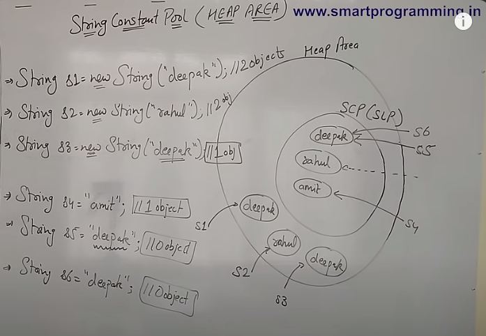
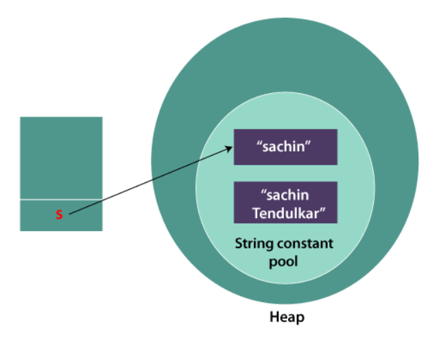
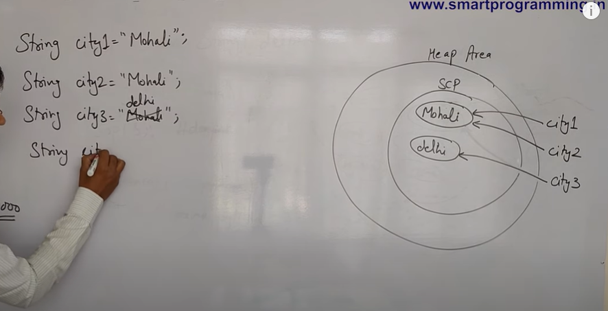
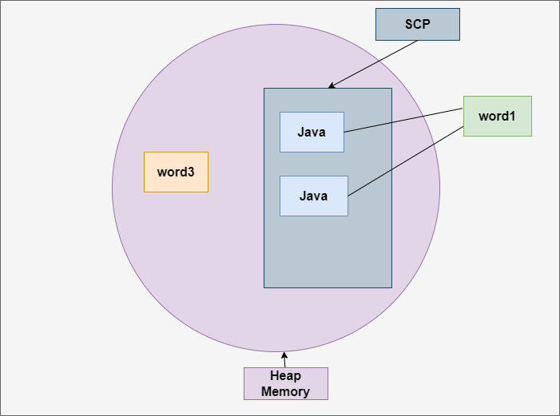

## Strings

- String is a non primitive data type because it references a memory location where data is stored in the heap memory(String constant pool) i.e, it references to a memory where object is actually placed. Thus the variable of non-primitive data type is also called reference data type and object reference variable. The object variable lives in the stack memory and the object to which it provides always lives on the heap memory. The stack holds a pointer to the object on the heap. Thus all non-primitive data types are simply called objects which are created by instantiating a class.

- String is a sequence of characters(Array of characters).
 
   ```java
    char[] c = {'a','s','h','i','s','h'};//charSequence is an interface to represent character.
    String s = new String(c);
   ```

- String is a class.

   **Syntax**

   ```java
   public final class String extends Object implements Serializable, Comparable<String>, CharSequence{
    //methods
    }
   ```
- String is an immutable object

  ```java
  String s = new String();//It is an immutable object.
  ```
- To create string there are 3 classes.

  - String
  - StringBuffer
  - StringBuilder

## String Constant Pool

- Till 1.6 version string constant pool was in method area. After 1.7 version string constant pool is in heap area because in method area the size was constant but in heap area we can increase or decrease the size of string constant pool.

- How string constant pool works?

  - using new keyword

  ```java
  String str = new String("Ashish");
  ```
  When using new keyword 2 objects are created one in heap memory and other in the string constant pool.When we use the new keyword with a string literal in the constructor (e.g., new String("hello")), it always creates a new string object in the heap memory, regardless of whether an identical string already exists in the constant pool. This means that even if the string "hello" is already present in the string constant pool, using new String("hello") will create a new object in the heap.
 
  - using string literal

   ```java
    String str = "Hello"'
   ```
   When using string constant pool only 1 objects are created in the String constant pool.The string constant pool is a special area of memory where string literals are stored. When you create a string literal using double quotes (e.g., "hello"), Java checks if a string with the same value already exists in the string constant pool. If it does, the new string literal refers to the existing string object. If not, a new string object is created in the pool.

   

   String Constant pool is not applicable for Garbage Collection as JVM internally creates reference variable for each string literal object.

## String immutable?

- A String is an unavoidable type of variable while writing any application program. String references are used to store various attributes like username, password, etc. In Java, String objects are immutable. Immutable simply means unmodifiable or unchangeable.

- Once String object is created its data or state can't be changed but a new String object is created.

```java

class Testimmutablestring{  
 public static void main(String args[]){  
   String s="Sachin";  
   s.concat(" Tendulkar");//concat() method appends the string at the end  
   System.out.println(s);//will print Sachin because strings are immutable objects  
 }  
}  

```


- But if we explicitly assign it to the reference variable, it will refer to "Sachin Tendulkar" object.

```java
class Testimmutablestring1{  
 public static void main(String args[]){  
   String s="Sachin";  
   s=s.concat(" Tendulkar");  
   System.out.println(s);  
 }  
}  

```
### Why String objects are immutable in java??

Strings are immutable in java because string objects are cached in String pool. Sinced cached String literals are shared between multiple person there is a risk, when one person action would affect all other persons, if one person changes its city from "Mohali" to "Delhi", all other person will also get affected.



### Important features of String class.

- **String Constant Pool** - It is a special memory area in heap area which stores string literal.

- **Immutable Objects** - The string objects are immmutable which means once string object is created its data or state can't be changed but a new string object is created.

- **+ Operator of String** - Multiple strings can be concatinated using + operator.

- **Security** - The parameters used for network connection, database connection URLs usernames/passwords etc are represented in Strings. If it was mutable, these paramters could be changes easily.

- **Class Loading** - String is used as an argument for class loading. If mutable, it could resist in the wrong class being loaded(because mutable object change their state).

- **Synchronization and Concurrency** - Making string immutable automatically makes them thread safe thereby solving the synchronization issues.

- **Memory management** - When compiler optimizes String objects, it seems that if two objects have the same value (a = "test" and b = "test") and thus we need only one string object(for both a and b , these two will point to the same object).

## Why String class are final?

The reason behind the String class being final is because no one can override the methods of the String class. So that it can provide the same features to the new String objects as well as to the old ones.

### Difference between final and immutable.

- final means that you can’t change the object’s reference to point to another reference or another object, but you can still mutate its state (using setter methods e.g). Whereas immutable means that the object’s actual value can’t be changed, but you can change its reference to another one.

- final modifier is applicable for variable but not for objects, Whereas immutability applicable for an object but not for variables.

- By declaring a reference variable as final, we won’t get any immutability nature, Even though reference variable is final. We can perform any type of change in the corresponding Object. But we can’t perform reassignment for that variable.

- final ensures that the address of the object remains the same whereas the Immutable suggests that we can’t change the state of the object once created.

Example - 

```java
final String name = "John";
name = "Same";//It will give compile error as we cant change the object reference.

String name = "John";
name = "Sam"; //We can change the object reference but can't mutate the object.
```

## Difference between == operator and equals() method.

```java
public class StringComparisonExample {  
    public static void main(String[] args) {  
        String word1 = "Java";  
        String word2 = "Java";  
        String word3 = new String("Java");  
  
        System.out.println(word1 == word2);       // Output: true  //It will print true as both the object is refering to the same object in String constant Pool
        System.out.println(word1 == word3);       // Output: false  //It will print false because one is pointing to the object in SCM and other in heap memory which was created by new keyword.
  
        System.out.println(word1.equals(word2));  // Output: true  
        System.out.println(word1.equals(word3));  // Output: true  
    }  
}  
```


**Equality operator(==)**

When used to compare strings, the equality operator compares the references (memory addresses) of the string objects rather than their contents. It determines whether two string objects refer to the exact same memory location. It returns true if the references are identical, meaning they point to the same memory address, and false if they do not.

**.equals() Method**
- It is a method of Object class.

- The .equals() method in Java is defined in the Object class, which is the root class for all objects in Java. It compares the content (values) of two objects for equality. 

### equals method in object class and string class.

```java
class Object{
    //11 methods in object class 
    public boolean equals(Object obj){
        return(this === obj);
    }
}
class Demo{
    public static void main(String args[]){
        String s1 = new String("ashish");
        String s2 = new String("ashish");
        System.out.println(s1==s2);
    }
}
```
equals() method of Object class is used to compare the reference or address of two objects i.e if two objects point to the same memory location or not

```java
class Strings extends Object{
    public boolean equals(Object obj){//this method override the method of object class and it provides its owns funcitonality as it dont check the memory address it check the content inside the object.
        //statements
    }

}
class Demo{
    public static void main(String args[]){
        String s1 = new String("ashish");
        String s2 = new String("ashish");
        System.out.println(s1.equals(s2));
    }
}

```
equals() method of String class is used for content comparison i.e it is used to check object value.

